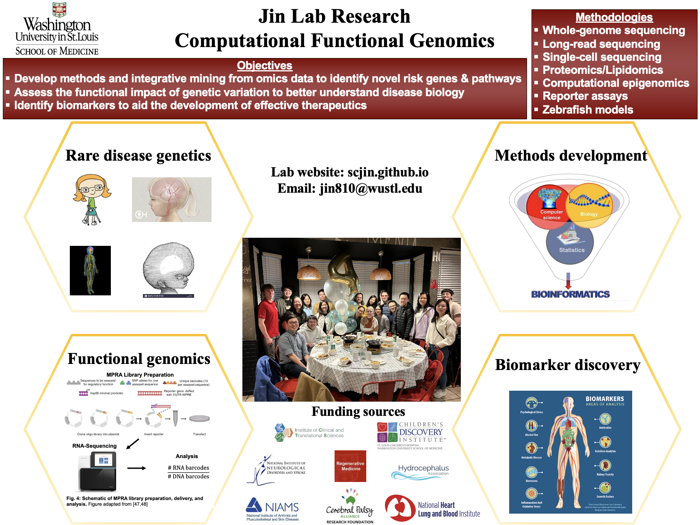

<link rel="stylesheet" href="styles.css" type="text/css">

  

Welcome to the Jin group in the [Department of Genetics](http://genetics.wustl.edu/) and the [McDonnell Genome Institute](https://www.genome.wustl.edu/) at the Washington University School of Medicine. Our mission is to provide meaningful and interpretable insight into disease biology, and define new targets for risk determination, prevention, and therapy. We are currently focusing on the formation, development, and application of human genetic, functional genomic, and bioinformatic methods to better analyze and integrate genome sequencing, single-cell RNA-sequencing, epigenomic, spatial genomic, and proteomic data. Through integration of diverse type of omics data and epigenetic functional annotations, the integrative genomic analysis will provide a better understanding of the molecular basis of cardiovascular diseases and neurological disorders. Following integrative genomic analyses, we use zebrafish and massively parallel reporter assays to precisely model human mutations. 

We collaborate with clinicians, the [Pediatric Cardiac Genomics Consortium](https://benchtobassinet.com/), the [Peripheral Neuropathy Research Registry](https://thepnrr.org/), the [Cerebral Palsy Research Network](https://cprn.org/), and the [WashU Undiagnosed Diseases Network](https://sites.wustl.edu/undiagnosed/) to assemble thoroughly phenotyped cohorts for gene discovery. We also collaborate with experimentalists to design scalable high-throughput assays to model effects of disease-associated mutations. If you think any of this sounds cool consider [joining us](./careers.html) in working to make the world a better place.

-----

These posters are meant to show that racial justice and support for marginalized communities cannot be separated from the practice of science. We must actively work to recognize the obstacles that scientists (and potential scientists) from marginalized communities face, and dismantle structures of power that prevent them from succeeding. We must also consider the effects of our research and research choices on marginalized communities. Please visit [here](https://sammykatta.com/diversity) for more diversity and inclusion lab posters! 

-----

 We are currently working on the following areas of research:

***Methods Development***

Human diseases, particularly complex ones like congenital heart diseases, neurodevelopmental disorders, and rare undiagnosed conditions, arise from the intricate interplay of genetic and environmental factors. Conventional investigative approaches often rely on simplistic inheritance models, focusing solely on germline or somatic variations. This approach overlooks the intricate interrelationships between these elements. To bridge this knowledge gap, we are developing advanced computational tools and statistical models capable of identifying and characterizing complex inheritance patterns. These encompass single nucleotide variants, uniparental disomy, short tandem repeats, mobile element insertions, mitochondrial DNA variants, and other structural variations. Our goal is to integrate and analyze germline and somatic variants, leveraging multi-omics data such as short-read sequencing, long-read sequencing, transcriptomics, and proteomics. This comprehensive approach aims to redefine our understanding and approach to studying and addressing complex diseases.

***Unravelling Molecular Signatures and Novel Therapeutic Targets for Idiopathic Peripheral Neuropathy***

Idiopathic peripheral neuropathy (IPN), a result of damage to the peripheral nerves with unknown causes, is a debilitating, painful, and as-yet-untreatable condition. Due to the unknown origin of the damage and the lack of targeted therapy, treatment for patients with IPN revolves around mere symptom management. In collaboration with Drs. [Jeffrey Milbrandt](http://milbrandt.wustl.edu/jeff-milbrandt/), [Ahmet Hoke](https://www.hopkinsmedicine.org/profiles/details/ahmet-hoke), [Aaron Di Antonio](https://sites.wustl.edu/diantonio/), and the [Peripheral Neuropathy Patient Registry](https://thepnrr.org/), we are integrating whole-genome sequencing and SOMAscan proteomic data in extreme IPN patients with negative clinical genetic screening results and performing bioinformatic analysis to identify variants, pathways, and biomarkers for pathophysiological clues to axon degeneration.

***Genomic Research of Cerebral Palsy and Dystonia***

In collaboration with Drs. [Michael Kruer](https://www.kruerlab.org/), [Carlos Cruchaga](https://cruchagalab.wustl.edu/), the [Dystonia Coalition](https://dc.rarediseasesnetwork.org/), and the [Cerebral Palsy Research Network](https://cprn.org/), we are applying an integrative, multidimensional omics approach to a large, well-phenotyped cerebral palsy/dystonia cohort to catalyze gene discovery, provide mechanistic insights into newly identified genetic causes, make genotype-phenotype correlations, and create a metadata ecosystem freely available to the cerebral palsy/dystonia community.

***Human Genetics and Molecular Mechanisms of Human Neurological Diseases***

In collaboration with Drs. [Kristopher Kahle](https://www.massgeneral.org/doctors/22473/kristopher-kahle), [Kristen Kroll](https://sites.wustl.edu/krolllab/), [Joe Dougherty](http://genetics.wustl.edu/jdlab/), and the [WashU Undiagnosed Diseases Network](https://undiagnoseddiseases.wustl.edu/), we are focusing on studying the genetic underpinnings of rare Mendelian forms of human neurological diseases, using whole-genome sequencing, quantitative phenotyping, transcriptomic profiling, massively parallel reporter assays, and in vitro/in vivo models.
