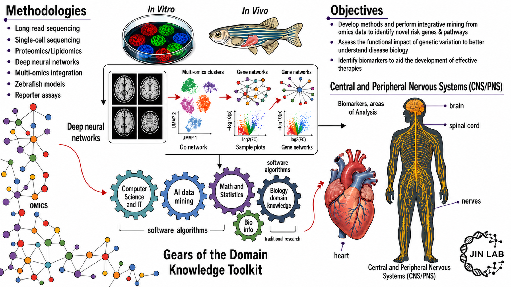

<link rel="stylesheet" href="styles.css" type="text/css">

  

# Decoding the Hidden Genetic Architecture of Human Disease

Welcome to the Jin lab in the [Department of Genetics](http://genetics.wustl.edu/) and the [McDonnell Genome Institute](https://www.genome.wustl.edu/) at the Washington University School of Medicine. 

**Why do patients with strongly genetic diseases remain genetically unexplained?**

This question lies at the heart of our research. Despite remarkable advances in genomic medicine, many patients with compelling genetic disorders remain without a molecular diagnosis. We believe that some of these missing explanations lie in genetic dark matter—forms of genetic variation, inheritance, and molecular regulation that are poorly captured by conventional genomic analyses and simple Mendelian models.

We study deeply phenotyped patients with cardiovascular, neurological, and undiagnosed disorders to uncover this hidden genetic architecture. By integrating human genetics, computational genomics, short- and long-read sequencing, multi-omics, and functional genomics, we seek to move from unexplained phenotype → genetic discovery → molecular mechanism → biological insight.

Our goal is not simply to identify disease-associated variants, but to make human disease genetically and biologically interpretable—improving molecular diagnosis, revealing disease mechanisms, and identifying new opportunities for prevention and therapy.

We work closely with the clinicians, patients, and research networks, including [Pediatric Cardiac Genomics Consortium](https://benchtobassinet.com/), the [Peripheral Neuropathy Research Registry](https://thepnrr.org/), the [Gabriella Miller Kids First Pediatric Research Program](https://portal.kidsfirstdrc.org/login?redirect_path=/dashboard), and the [WashU Undiagnosed Diseases Network](https://sites.wustl.edu/undiagnosed/)

**A negative genome is not necessarily the absence of a genetic explanation. It may mean that we have not yet learned how to ask the genome the right question.**

If you think any of this sounds cool, consider [joining us](./careers.html) in working to make the world a better place.

-----

These posters are meant to show that racial justice and support for marginalized communities cannot be separated from the practice of science. We must actively work to recognize the obstacles that scientists (and potential scientists) from marginalized communities face, and dismantle structures of power that prevent them from succeeding. We must also consider the effects of our research and research choices on marginalized communities. Please visit [here](https://sammykatta.com/diversity) for more diversity and inclusion lab posters! 

-----

We are currently working on the following areas of research:

***Genetic Dark Matter: Beyond Conventional Genomic Analysis***

Why do patients remain genetically unexplained even after exome or whole-genome sequencing?

We develop computational and statistical approaches to uncover genetic variation and inheritance patterns that conventional analyses often miss. These include structural variants, short tandem repeats and repeat expansions, uniparental disomy, mitochondrial and mitonuclear variation, somatic mosaicism, regulatory variation, and complex or multilocus inheritance.

By integrating short- and long-read genome sequencing with transcriptomic, epigenomic, proteomic, and functional data, we aim to build a systematic framework for moving beyond a “negative” genetic test toward a mechanistic explanation of disease.

***Idiopathic Peripheral Neuropathy: From Genome-Negative Disease to Molecular Mechanism***

Idiopathic peripheral neuropathy (IPN) is a debilitating disorder in which patients experience progressive sensory loss, weakness, and pain without a known cause. Many remain unexplained even after clinical genetic testing.

In collaboration with Drs. [Jeffrey Milbrandt](http://milbrandt.wustl.edu/jeff-milbrandt/), [Ahmet Hoke](https://www.hopkinsmedicine.org/profiles/details/ahmet-hoke), and the [Peripheral Neuropathy Patient Registry](https://thepnrr.org/), we integrate genome sequencing, proteomics, transcriptomics, and functional studies to identify cryptic genetic variation, molecular signatures, and pathways underlying axonal degeneration.

Our goal is to transform idiopathic disease into biologically defined disease and reveal new opportunities for diagnosis and therapy. 

***Congenital Heart Disease: Beyond Simple Mendelian Inheritance***

Congenital heart disease (CHD) affects approximately 1% of live births, yet a substantial proportion of cases remain genetically unexplained.

We investigate whether this missing architecture arises from forms of variation and inheritance overlooked by conventional analyses—including rare inherited and de novo variation, recessive and complex inheritance, structural variation, uniparental disomy, somatic mosaicism, and regulatory variation.

Using short- and long-read sequencing, computational genetics, and functional models, we seek to understand how complex genetic architecture disrupts human cardiac development.

***Neurological Disease: From Human Genetic Discovery to Developmental Mechanism***

We investigate the genetic and molecular basis of congenital hydrocephalus, cerebral palsy, cerebrovascular malformations, and other rare neurodevelopmental disorders.

In collaboration with Drs. [Michael Kruer](https://www.kruerlab.org), [Kristopher Kahle](https://www.massgeneral.org/doctors/22473/kristopher-kahle), [David Limbrick](https://neurosurgery.vcu.edu/about/our-team/david-d-limbrick-jr-md-phd.html), [Engin Deniz](https://medicine.yale.edu/profile/engin-deniz/), and the [WashU Undiagnosed Diseases Network](https://undiagnoseddiseases.wustl.edu/), we combine genome sequencing and quantitative phenotyping with multi-omic profiling, computational genetics, massively parallel functional assays, and cellular and in vivo models. 

Our goal is to move from human genetic discovery to developmental mechanism and identify principles of disease architecture that extend beyond any single neurological disorder.
