[April 5, 2024] **Emma Casey joins the lab for her thesis study. Welcome to the Jin lab!**

[March 29, 2024] **We marked the Jin lab’s 4th birthday at ChiliSpot. It's been an amazing four years, and here's to many more years of fun and productivity ahead!**

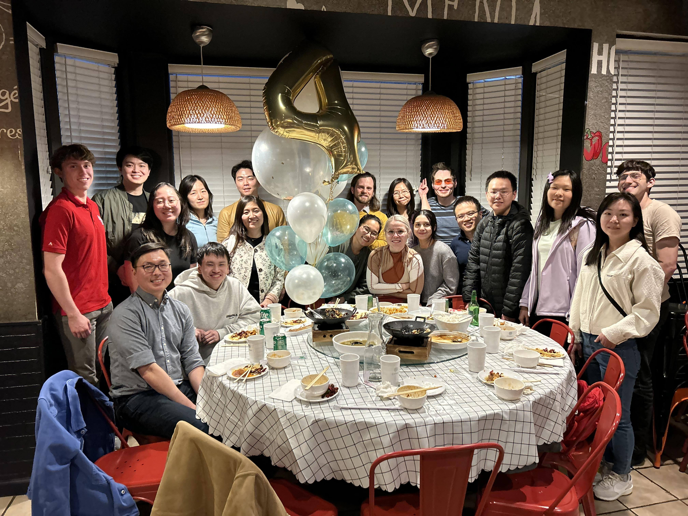

[March 27, 2024] **Incredible headshots capturing the essence of our current Jin lab members! Huge thanks to our exceptional genetic department marketing manager, Eliza, for her outstanding work!**

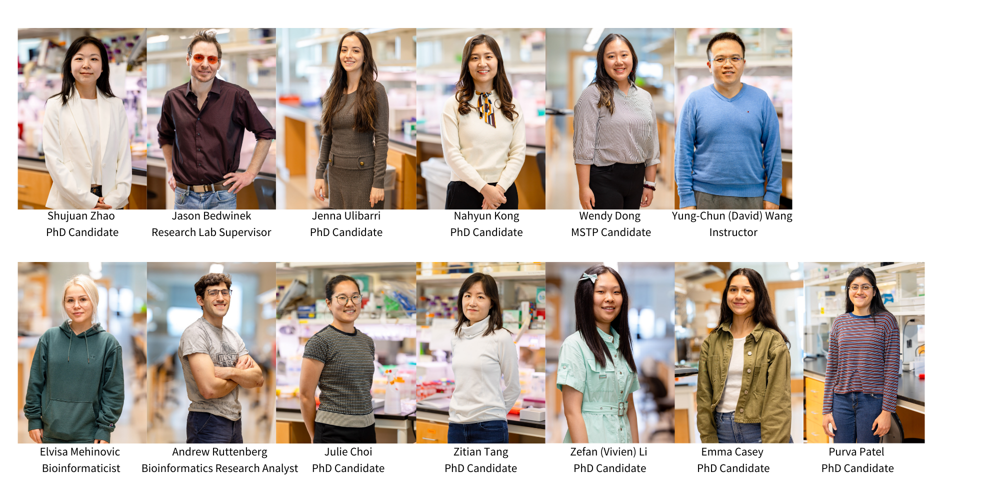

[February 2, 2024] **Jin lab conquers the Dracula and Jurassic Island escape rooms at St Louis Escape, experiencing exhilarating spooks and thrills. Such an incredible and fun adventure!**

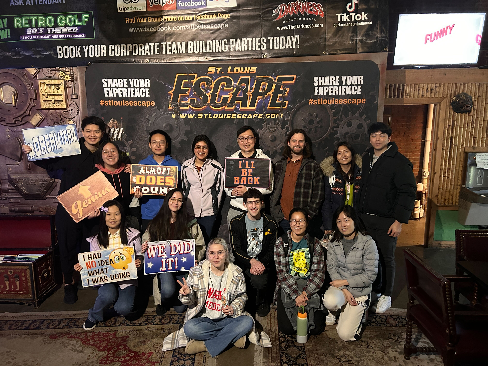

[January 8, 2024] **Brian Yu joins the lab as an undergraduate researcher! Welcome Brian!**

[January 8, 2024] **Vivien Li joins the lab as a rotation student! Welcome Vivien!**

[December 19, 2023] **Big congrats to grad student Jenna Ulibarri for being selected into Washington University’s T32 Cellular and Molecular Biology Program. We are so very proud of you!**

[December 15, 2023] **Celebrating the end of 2023 with a fantastic Jin Lab party at Chase Club in St. Louis! Excited for the incredible scientific breakthroughs ahead with this exceptionally talented and kind group.**

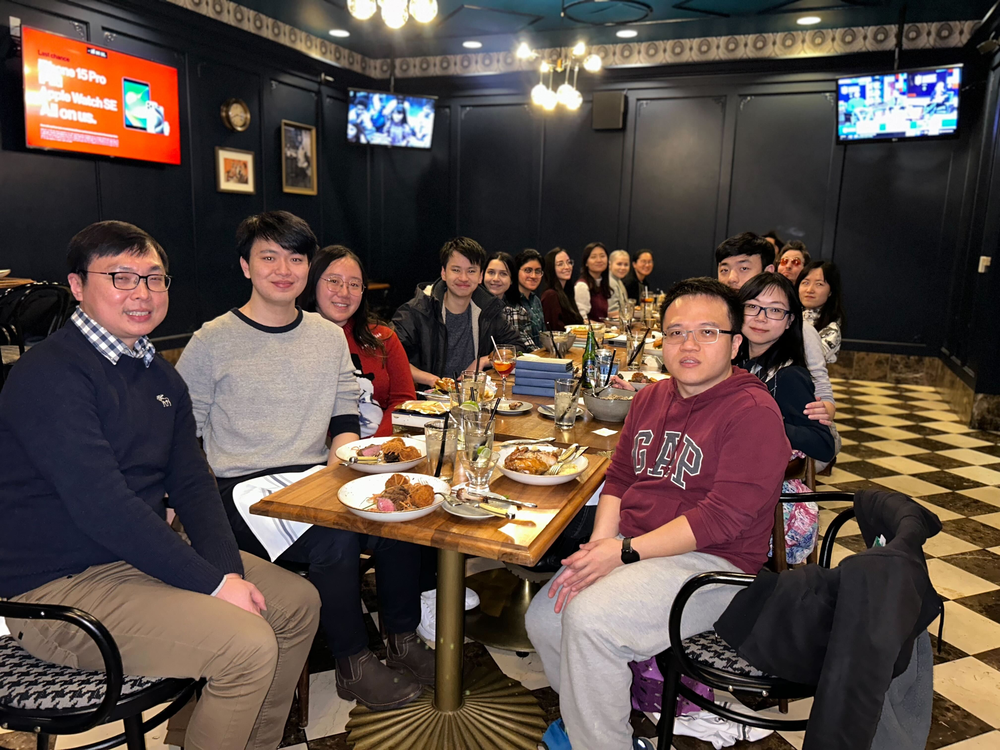

[November 17, 2023] **Fantastic collaborative paper led by grad student Shujuan Zhao is now online in [Nature Communications](https://www.nature.com/articles/s41467-023-43062-z)**

[November 1, 2023] **Qichen Fu joins the lab as a rotation student! Welcome Qichen!**

[October 20, 2023] **Purva Patel joins the lab as a rotation student! Welcome Purva!**

[October 16, 2023] **Boo at the Zoo, decked out in festive splendor, crafted an unforgettable and enchanting adventure for our lab outing. A fantastic way to kick off the Halloween**

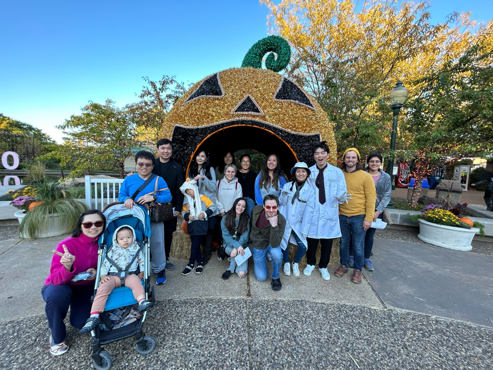

[September 26, 2023] **Congratulations to our postdoc Yung-Chun Wang who has been awarded with a Scholarship to attend Cold Spring Harbor Laboratory's Scientific Writing Retreat Course.**

[September 25, 2023] **Jason Bedwinek joins the lab as a senior research technician! Welcome Jason!**

[August 31, 2023] **Big congrats to grad student Wendy Dong (joint with Jeff Milbrandt) for being selected into Washington University’s T32 Genome Analysis Training Program. We are so very proud of you!**

[August 23, 2023] **Emma Casey joins the lab as a rotation student! Welcome Emma!**

[August 18, 2023] **Had a blast at City Foundry STL for our lab outing, celebrating and welcoming our newest rotation student, Emma Casey, to the Jin lab!**

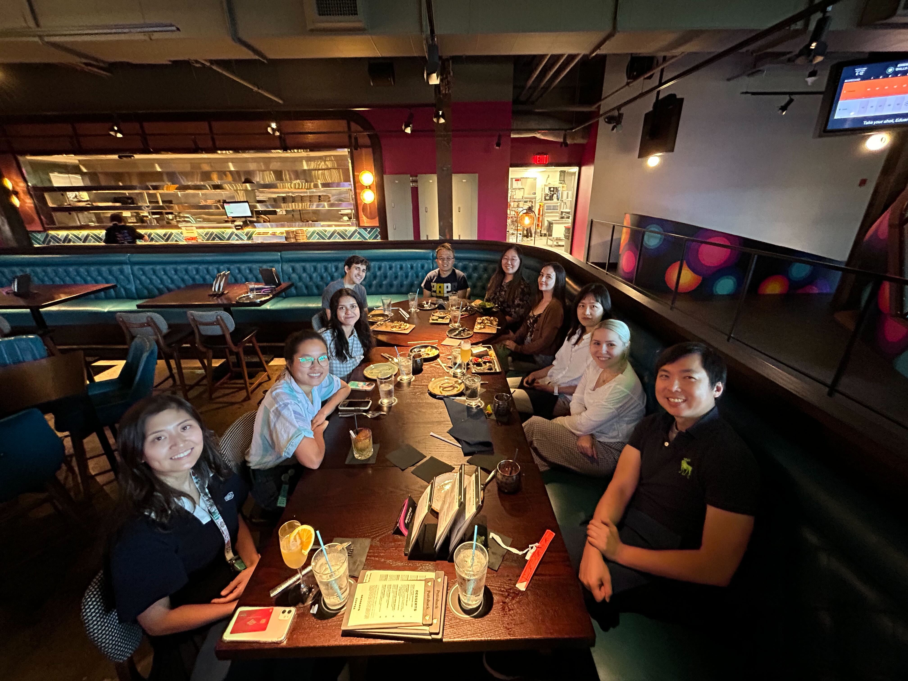
 
[July 26, 2023] **Andrew Ruttenberg joins the lab as a research technician II! Welcome Andrew!** 

[July 6, 2023] **Congratulations to our grad student Zitian Tang on being selected into the prestigious Precision Medicine Pathway. We are so proud of you.**

[June 15, 2023] **Jenna Ulibarri joins the lab for her thesis study. Welcome to the Jin lab!**

[May 27, 2023] **Congratulations to our graduate student Zitian Tang who has been awarded with a Scholarship to attend Jackson Laboratory's Human and Mammalian Genetics and Genomics: The McKusick Short Course.**

[May 26, 2023] **Zitian Tang joins the lab for her thesis study. Welcome to the Jin lab!**

[April 14, 2023] **"Parting is such sweet sorrow," but celebrating with a warm party at the beautiful Botanical Garden makes it a bit easier. We want to extend our heartfelt appreciation to Po-Ying for her invaluable contribution to the Jin Lab during the past three years. You will be greatly missed! We wish you all the best in your future endeavors.!**

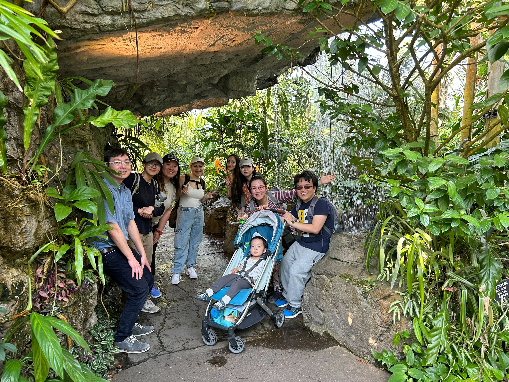
  
[April 13, 2023] **Elvisa Mehinovic joins the lab as a bioinformaticist! Welcome Elle!**

[April 7, 2023] **Justin Chen joins the lab as a rotation student! Welcome Justin!**

[January 31, 2023] **Big congrats to grad student Wendy Dong (joint with Jeff Milbrandt) for being selected into Washington University’s T32 Genome Analysis Training Program. We are so very proud of you!**

[January 27, 2023] **Fun Jin lab outing to celebrate Lunar New Year, new grant, and new paper at Chilispot!**

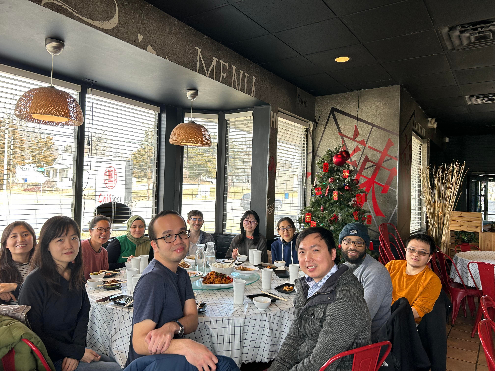

[January 20, 2023] **Yu-Liang Yeh joins the lab as a rotation student! Welcome Yu-Liang!**

[December 16, 2022] **Wendy Dong, a MD/Ph.D. student, joins both Milbrandt's and Jin's labs for her thesis study. Welcome aboard Wendy!**

[December 16, 2022] **We celebrated Shujuan's passing her thesis update and Nahyun's passing her qualifying exam!! Congratulations Shujuan and Nahyun!!**

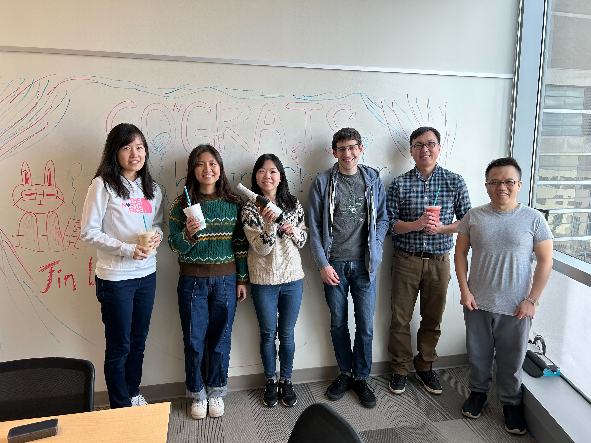

[December 15, 2022] **Our challenge solution has been chosen as a winner of the 2022 PCGC and CDDRC Challenge Prize!**

[December 15, 2022] **Congratulations to Nahyun for passing her qualifying exam. Now officially a PhD candidate. Woot! Woot! Woot!**

[November 23, 2022] **Congrats to grad student Nahyun Kong for receiving the prestigious Study Abroad Scholarships from the Mogam Science Scholarship Foundation. We are very proud of you Nahyun!**

[November 7, 2022] **Zitian Tang joins the lab as a rotation student! Welcome Zitian!**

[Oct 28, 2022] **We had a blast at First Watch (Central West End) for our lab lunch event.**

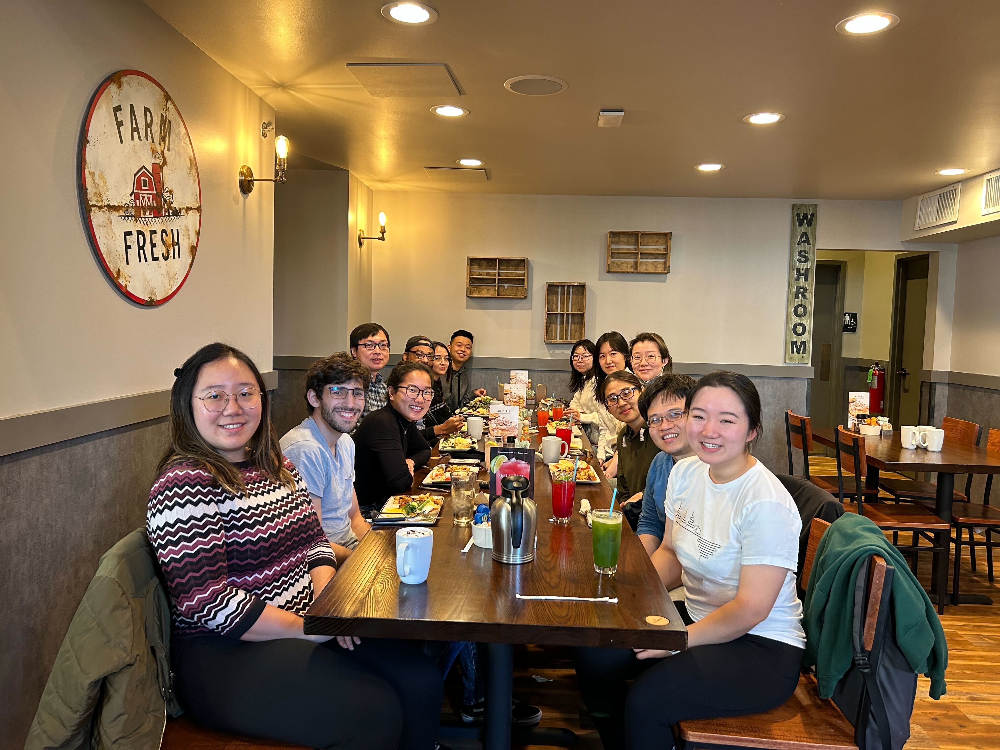

[Oct 13, 2022] **Big congrats to grad student Julie Choi for being selected into Washington University’s T32 Genome Analysis Training Program. We are so very proud of you!**

[Sept 30, 2022] **Former and current lab affiliates went to Pappy's for its famous ribs and then headed to the City Museum. We all had a blast!**

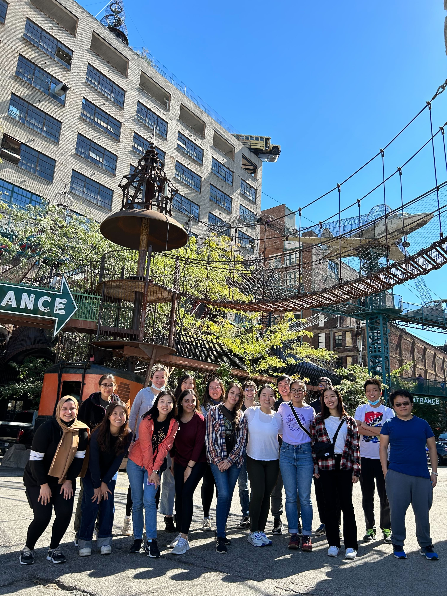

[Sept 27, 2022] **Incredible experience and privilege to work with Jeff Milbrandt, Rob Gereau, Aaron DiAntonio, Valeria Cavalli, Guoyan Zhao, Bryan Copits and many other collaborators. We are proud of our WashU U19 Center being selected for funding!**

[INTERCEPT: Integrated Research Center for human Pain Tissues](https://reporter.nih.gov/search/qS4SPGBPCUCdw9aW-6gm9g/project-details/10593843)

[Sept 21, 2022] **Andrew Ruttenberg joins the lab as an undergraduate researcher for his senior thesis! Welcome Andrew!**

[Sept 14, 2022] **Ai Zhang joins the lab as a rotation student! Welcome Ai!**

[Aug 17, 2022] **Jenna Ulibarri joins the lab as a rotation student! Welcome Jenna!**

[Aug 17, 2022] **Tugce Iyiyol joins the lab as an undergraduate researcher! Welcome Tugce!**

[Aug 4, 2022] **Farewell to our OGR summer students Athziri and Carib! Thank you for everything that you’ve accomplished so far, and good luck with everything you will do in the future.**

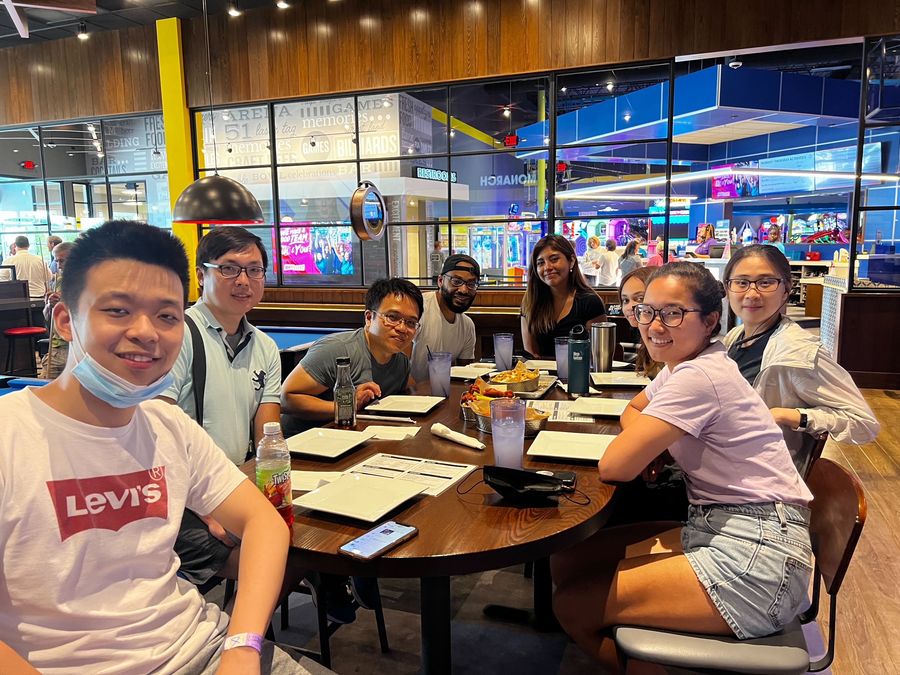 

[July 21, 2022] **Devin Qiu joins the lab as a research assistant! Welcome Devin!**

[June 30, 2022] **Vincent Gillespie joins the lab as a rotation student! Welcome Vincent!**

[June 22, 2022] **Congratulations to grad students Nahyun Kong and Julie Choi on being selected into the prestigious Precision Medicine Pathway. We are so proud of you both.**

[June 17, 2022] **Congratulations to Julie (grad student in the Jin lab and Milbrandt lab) for passing her qualifying exam. Now officially a PhD candidate. Woot! Woot! Woot!**

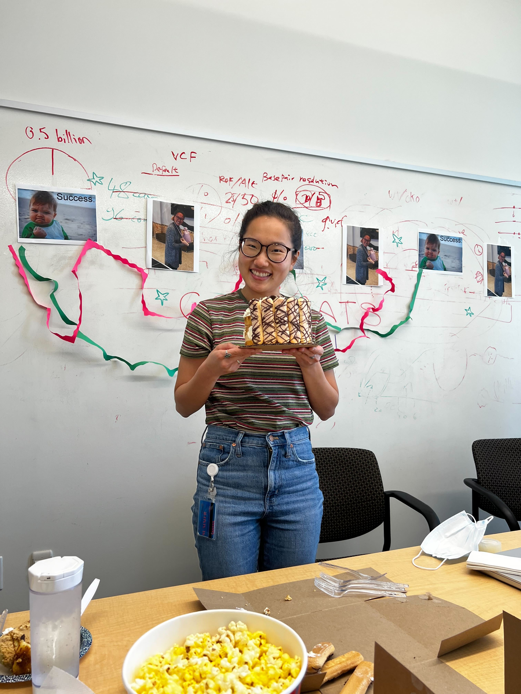

[June 9, 2022] **Boating in the Boathouse at Forest Park is fun! Enjoying the sun with the lab members!**

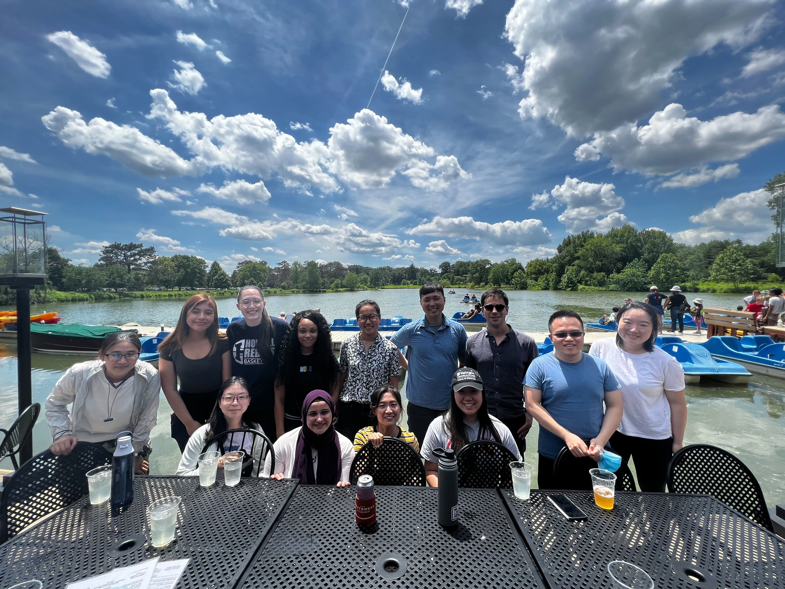

[June 6, 2022] **Amazing cupcake made by Wendy and Yuxiao for Shujuan Zhao's birthday. This birthday cupcake event is becoming a lab tradition. Also welcoming our summer students Cabria and Athziri! So fun!!!**

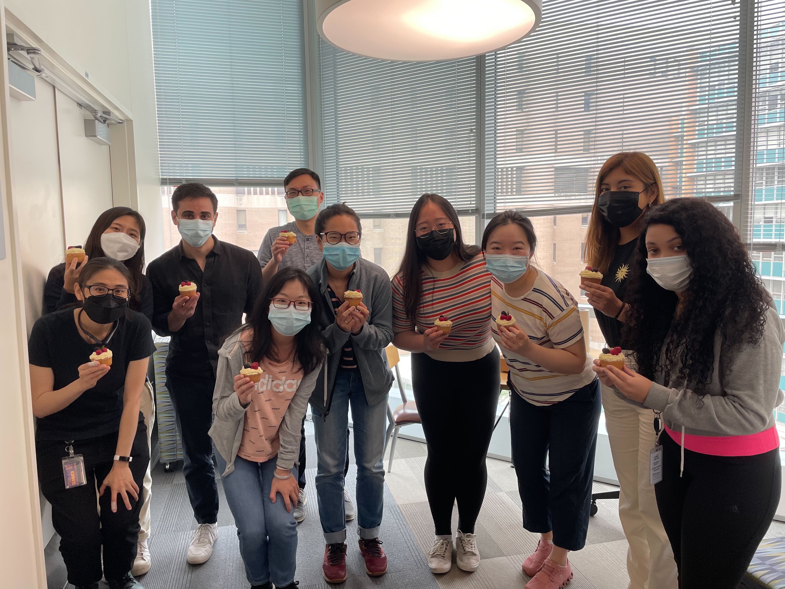

[June 6, 2022] **Cabria Shelton joins the lab as a McDonnell Genome Institute Opportunities in Genomics Research Summer Student! Welcome Cabria!**

[June 1, 2022] **Athziri Marcial Rodriguez joins the lab as a McDonnell Genome Institute Opportunities in Genomics Research Summer Student! Welcome Athziri.**

[May 30,2022] **We now have our lab mascot Ziggy! Guess what breed Ziggy is? Ragamuffin or Ragdoll? Take a guess!**

[May 18, 2022] **Shujuan Zhao got admitted into the prestigious Lucille P. Markey Special Emphasis Pathway in Human Pathobiology! Congratulations Shujuan!**

[May 12, 2022] **Lab outing to welcome WUSTL MSTP rotation students Yuxiao Xu and Wendy Dong at Brasserie by Niche!**

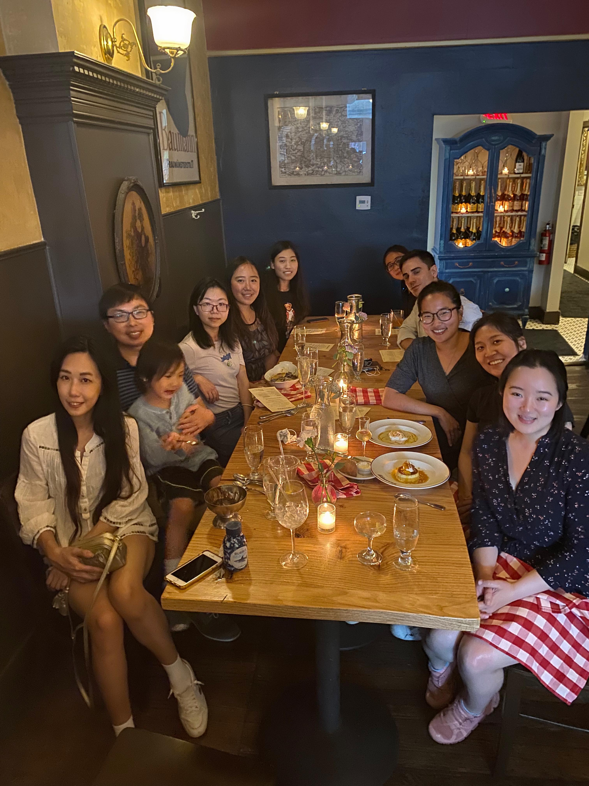

[May 12, 2022] **Yuxiao Xu and Wendy Dong, two WUSTL MSTP studnets, join the lab as rotation students! Welcome Yuxiao and Wendy!**

[May 10, 2022] **Congratulations to our graduate students Shujuan Zhao and Max Wrubel who have been awarded with Scholarships to attend Jackson Laboratory's Human and Mammalian Genetics and Genomics: The McKusick Short Course.**

[April 22, 2022] **Dr. Jin hass been awarded the 2021 Cerebral Palsy Alliance Research Foundation Project Grant from the Cerebral Palsy Alliance Research Foundation for the projecct "Discovery of novel genetic variations in cerebral palsy by whole genome sequencing."**

[March 21, 2022] **Nahyun Kong joins the lab for her thesis study. Welcome to the Jin lab!**

[February 9, 2022] **Lab outing to celebrate our recent publication and the Hydrocephalus Association Innovator Award!**

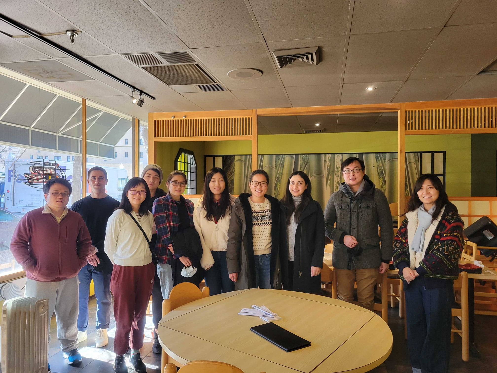

[January 17, 2022] **Julie Choi joins the lab for her thesis study. Julie will be co-advised by Peter and Dr. Jeff Milbrandt. Welcome back Julie!**

[January 17, 2022] **Nahyun Kong joins the lab as a rotation student! Welcome Nahyun!**

[January 13, 2022] **Lei Lu joins the lab as a rotation student! Welcome Lei!**

[December 15, 2021] **The group celebrates another fun and exciting-science-filled year with an equally fun party at Edera italian Eatery.**

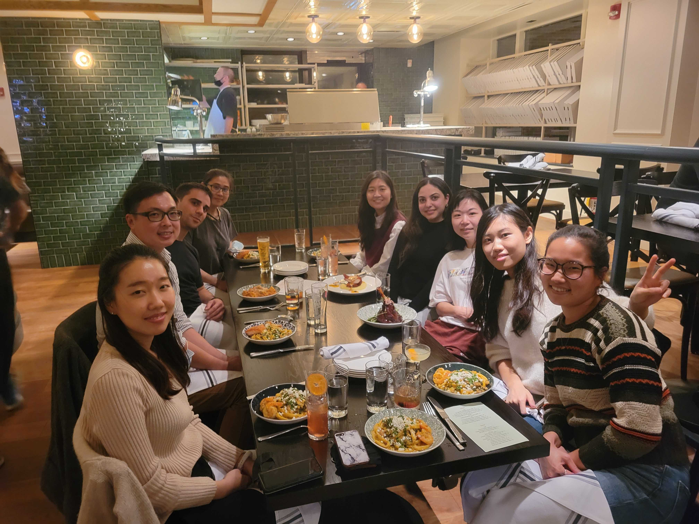

[November 10, 2021] **Max Wrubel joins the lab as a McDonnell Genome Institute Opportunities in Genomics Research Student! Welcome Max.**

[November 4, 2021] **Dr. Jin has been awarded the 2021 Hydrocephalus Association Innovator Award for the project "A genome-wide assessment of noncoding risk variants in congenital hydrocephalus."**

[November 2, 2021] **Our first annual lab retreat was lots of fun at the Boathouse at Forest Park.**

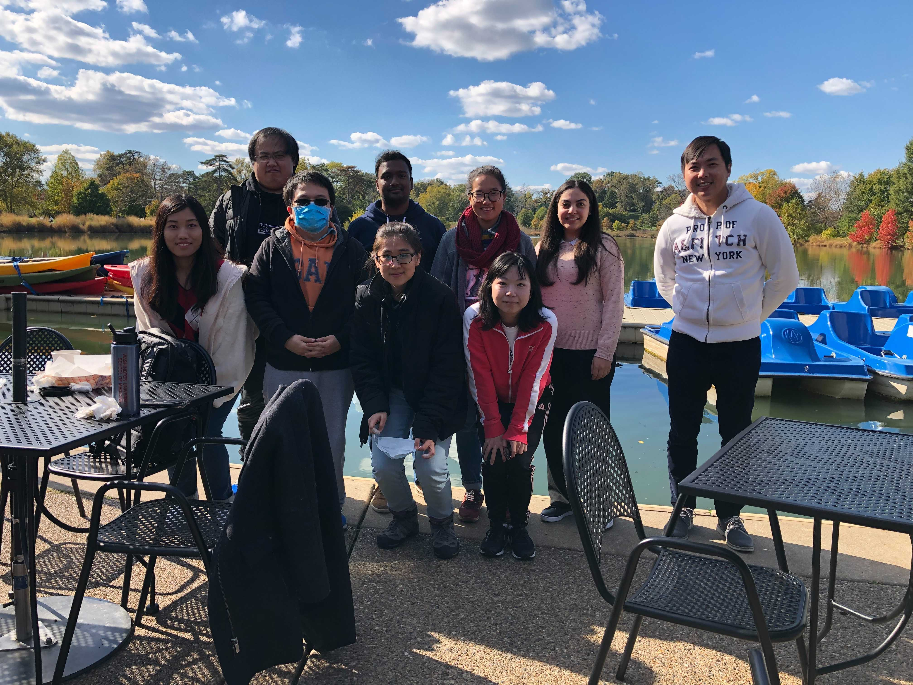

[October 28, 2021] **Julie Choi joins the lab as a rotation student! Welcome Julie!**

[October 1, 2021] **Dr. Jin has been awarded the 2021 Children's Discovery Institute Faculty Scholar Award from WashU CDI for the project "Human genetics and molecular mechanisms of cerebral palsy."**

[September 22, 2021] **Kuangying Yang joins the lab as a rotation student! Welcome Kuangying!**

[September 10, 2021] **Mariam Khanfar joins the lab as a rotation student! Welcome Mariam!**

[September 1, 2021] **Prashant Kumar Kuntala joins the lab as a rotation student! Welcome Prashant!**

[July 24, 2021] **Our Genes paper was selected as the cover for the 2021 July issue.**

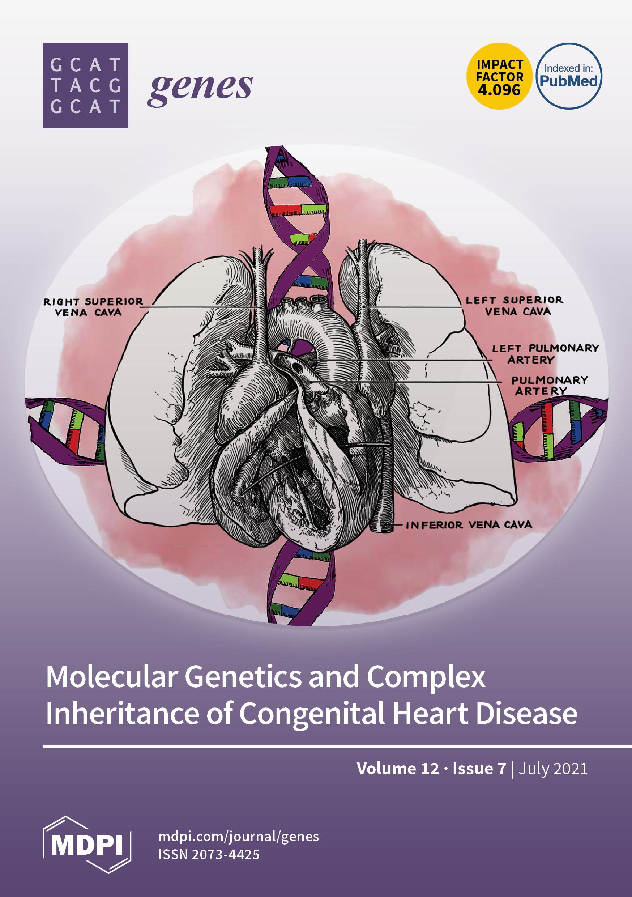

[July 9, 2021] **Summer lab outing with great food and drinks**

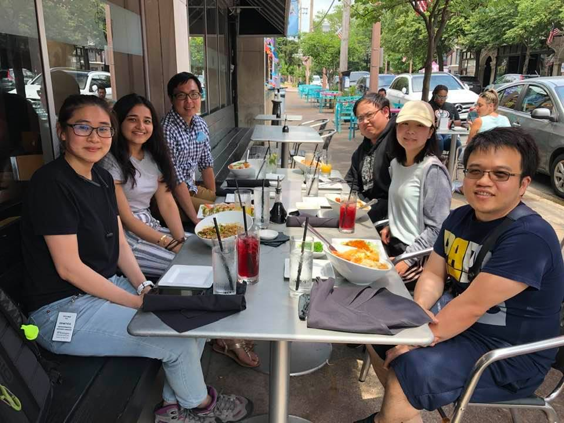

[May 1, 2021] **Yung-Chun (David) Wang has been awarded a prestigious Center of Regenerative Medicine Postdoctoral Fellowship and will join the lab as a postdoc fellow! Welcome David!**

[April 25, 2021] **Kareena Joshipura joins the lab as s summer intern! Welcome Kareena!**

[April 14, 2021] **Kesava Viswanadha joins the lab as a summer intern! Welcome Kesava!**

[April 7, 2021] **Dr. Jin's co-corresponding authored paper on Moyamoya genomics was accepted in JAMA Neurology. Sam is a co-1st author and Shujuan is an author!**

[March 26, 2021] **Amar Sheth, a medical student at Yale, has been admitted to the Clinical Research Training Center’s TL1 One-Year Predoctoral Program. He will be working with Dr. Jin and Dr. Milbrandt to perform integrative genomic analysis of cerebral palsy and rare pediatric movement disorder! Welcome on board Amar!**

[February 8, 2021] **Jin lab has been awarded a Zebrafish Models for Pediatric Research Services Cooperative Micro-grant to generate zebrafish knock-in lines to functionally characterize mutations' impact on vascular development!**

[February 1, 2021] **Changfeng Chen joins the lab as a rotation student! Welcome Changfeng!**

[January 26, 2021] **Shohaib Shaffiey joins the lab as a student research assistant! Welcome Shohaib!**

[January 21, 2021] **Xiaobing (Dean) Yu joins the lab as a student research assistant! Welcome Xiaobing!**

[January 11, 2021] **Dr. Jin's first paper being a corresponding author has been accepted in STAR Protocols. Graduate students Spencer (co-1st) and Sam are major authors.** 

[November 11, 2020] **Dr. Jin has been awarded the 2020 Clinical and Translational Research Funding Program from WashU ICTS to investigate complex genetic model using long-read genome sequencing and integrative genomic analysis for cerebral palsy!**

[November 6, 2020] **Jian Ryou joins the lab as a rotation student! Welcome Jian!**

[September 25, 2020] **Shujuan Zhao joins the lab for her thesis study! Welcome Shujuan!**

[September 4, 2020] **Shujuan Zhao joins the lab as a rotation student! Welcome Shujuan!**

[September 3, 2020] **Dr. Jin's co-1st authored paper on trigeminal neuralgia genomics was accepted in iScience!**

[June 24, 2020] **Dr. Jin's lead author paper on congenital hydrocephalus genomics was accepted in Nature Medicine!**

[April 30, 2020] **Dr. Jin's lead author paper on cerebral palsy genomics was accepted in Nature Genetics!** 

[April 1, 2020] **Po-Ying Fu joins the lab as a Bioinformatics Research Analyst! Welcome Po-Ying!**

[April 1, 2020] **The lab received R01 subaward funding (PI: Kahle) from the National Institute of Neurological Disorders and Stroke for the project "Human Genetics and Molecular Mechanisms of Congenital Hydrocephalus"**

[April 1, 2020] **The lab received R00 funding (PI: Jin) from the National Heart, Lung, and Blood Institute for the project "Integrative Genomic Analysis of Congenital Heart Disease"**

[April 1, 2020] **Jin Lab opens**		

[February 27, 2020] **Sam Peters joins the lab as a summmer intern! Welcome Sam!**

[February 5, 2020] **Spencer King joins the lab as a summmer intern! Welcome Spencer! You are our first lab member!**  

[January 1, 2020] **Postdoc Wanted: Computational Genomics in Congenital Disorders**
