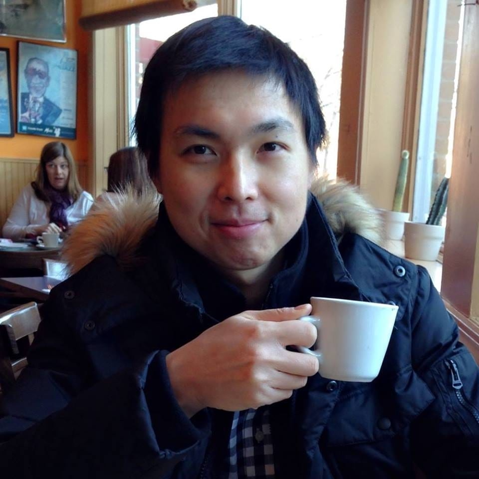
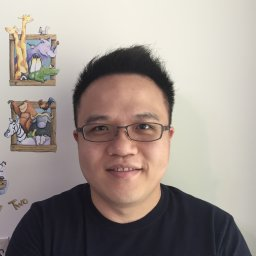
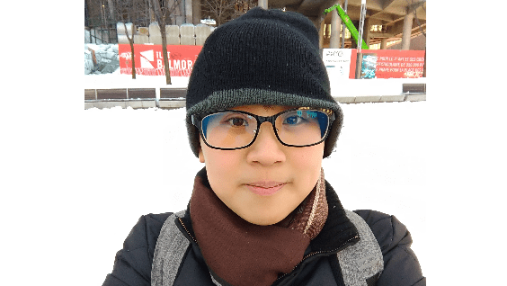
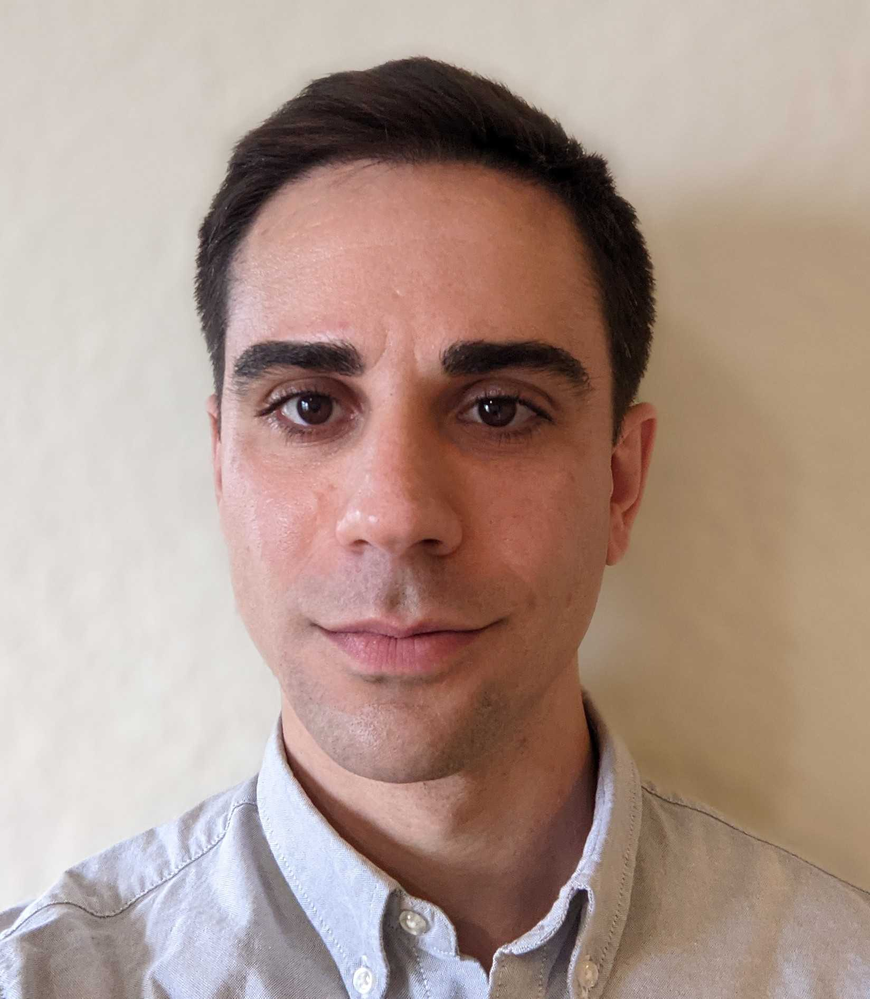
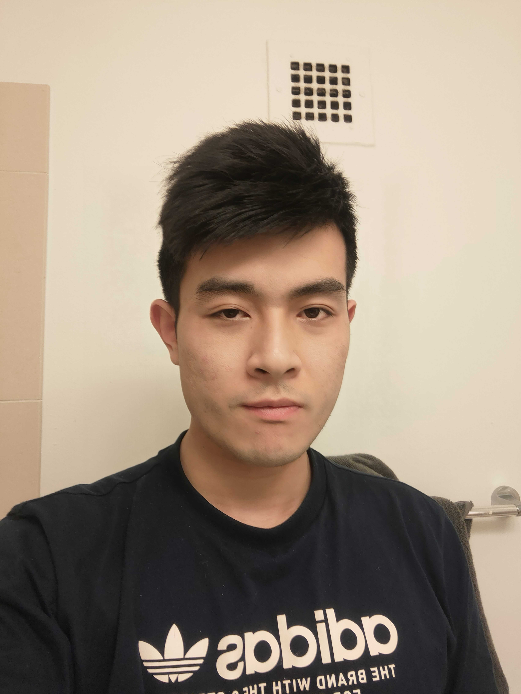

### Principal Investigator

__Sheng Chih (Peter) Jin__

Peter is Assistant Professor of Genetics and Pediatrics at the Washington University School of Medicine. He is interested in understanding how genetic variation affects disease biology and using genetic and genomic analyses to infer the molecular mechanisms underlying neurodevelopmental and cardiovascular diseases. His full CV is available [here](files/CV-WUSM-CV-format-11-24-2021.pdf).

*NIH Grants*

* R00HL143036: Integrative Genomic Analysis of Congenital Heart Disease (Role: PI) (Active)
* R01NS111029: Human Genetics and Molecular Mechanisms of Congenital Hydrocephalus (Role: Co-Investigator) (Active)
* R01AR067715: Genetic Risk Factors for Severe Scoliosis (Role: Co-Investigator) (Active)
* R01NS117609: Human Genetics and Molecular Mechanisms of Vein of Galen Aneurysmal Malformation (Role: Co-Investigator) (Active)   

*Selected Honors and Awards*

* Hydrocephalus Association Innovator Award, 2021
* Children's Discovery Institute Faculty Scholar, 2021-2026
* Children’s Discovery Institute Zebrafish Models for Pediatric Research Services Cooperative Micro-Grant Award, 2021
* Washington University Institute of Clinical and Translational Research Funding Program Award, 2020
* K99/R00 Pathway to Independence Award, NHLBI, NIH
* American Heart Association Postdoctoral Fellowship
* James Hudson Brown – Alexander B. Coxe Fellowship, Yale School of Medicine
* Howard Hughes Medical Institute Postdoctoral Fellowship, Howard Hughes Medical Institute at Yale School of Medicine
* Fellow, Lucille P. Markey Special Emphasis Pathway in Human Pathobiology, Markey Foundation, Washington University School of Medicine

-----

### Postdoctoral Researchers and Fellows

__Yung-Chun (David) Wang__,
Center of Regenerative Medicine Postdoctoral Fellow, Washington University School of Medicine

David earned a B.S. in Agriculture Chemistry from the National Taiwan University. He did his Ph.D. with Dr. Shiyou Chen studying the mechanism underlying the regulation of JAK3 in abdominal aortic aneurysm at the University of Georgia. David has received a prestigious Center of Regenerative Medicine Postdoctoral Fellowship. He is focused on genetic analyses and functional genomics of Moyamoya and cerebral palsy projects.

-----

### Graduate Students

__Shujuan Zhao__,
Ph.D. Candidate (DBBS Molecular Genetics and Genomics), Washington University School of Medicine

Shujuan is a 3rd year Ph.D. student at Washington University in St. Louis with a background in biochemistry and nuclear magnetic resonance. She is working with Dr. Jin and Dr. Kahle at Yale to figure out the genetic etiology and molecular mechanisms of Vein of Galen aneurysmal malformation and Moyamoya disease.

-----

### Staff

__Po-Ying Fu__,
Bioinformatics Research Analyst, Washington University in St. Louis 

Po-Ying obtained her master's degree in microbiology specialized in bioinformatics from Soochow University. In her master's thesis, she performed genomics analysis and used cell biology approaches to reveal the anti-cancer ability of lipopolysaccharide binding peptides. To advance her programming skills, she completed several advanced computer science courses at 42 Silicon Valley (a software engineering school) and Ohlong College.  She loves cycling and traveling!

-----

### Rotation Students and Interns

__Max Wrubel__,
McDonnell Genome Institute OGR Student

__Lei Lu__,
Rotation PhD student (Computer Science & Engineering)

-----

### Alumni

__Julie Choi__ - Rotation Student (Human & Statistical Genetics), 2021/10 - 2021/12

__Mariam Khanfar__ - Rotation Student (Human & Statistical Genetics), 2021/09 - 2021/12

__Kuangying Yang__ - Rotation Student (Human & Statistical Genetics), 2021/09 - 2021/12

__Xiaobing (Dean) Yu__ - Master's student (Computer Science & Engineering), 2021/03 - 2021/11; currently Master's student at WashU

__Prashant Kumar Kuntala__ - Rotation Student (Computational and Systems Biology), 2021/09 - 2021/11

__Kareena Joshipura__ - Mount Holyoke College's Lynk Fellow, 2021/04 - 2021/09; currently a senior at Mount Holyoke College

__Changfeng Chen__ - Rotation Student (Molecular Cell Biology), 2021/02 - 2021/04

__Jian Ryou__ - Rotation Student (Human & Statistical Genetics), 2020/11 - 2021/02

__Sam Peters__ - Master's student (Bioinformatics and Computational Biology at SLU), 2020/05 - 2021/04; currently Master's student at SLU

__Spencer King__ - Master's student (Computer Science & Engineering), 2020/05 - 2021/05; currently summer intern at WashU Institute for Informatics

__Shohaib Shaffiey__ - Master's student (Computer Science & Engineering), 2021/02 - 2021/05; currently Master's student at WashU

