### Principal Investigator

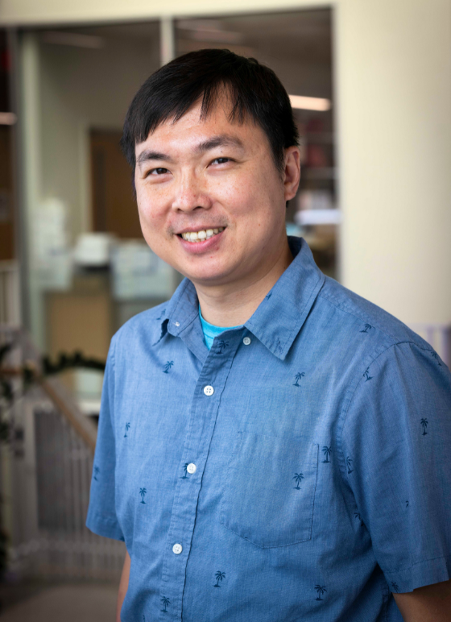

__Sheng Chih (Peter) Jin__

Peter is Assistant Professor of Genetics and Pediatrics at the Washington University School of Medicine. He is interested in understanding how genetic variation affects disease biology and using genetic and genomic analyses to infer the molecular mechanisms underlying neurodevelopmental and cardiovascular diseases. His full CV is available [here](files/CV-WUSM-CV-format-11-2-2025.pdf).

*NIH Grants*

* R01NS131610: Molecular and Cellular Characterization of Congenital Hydrocephalus (Role: PI)(Active)
* R01NS111029: Human Genetics and Molecular Mechanisms of Congenital Hydrocephalus (Role: Co-PI) (Active)
* U19NS130607: INTERCEPT: Integrated Research Center for Human Pain Tissues (Role: Project 1 Co-PI and Data Core Co-PI) (Active)
* UM1DA058219: WashU-VAI Somatic Mosaicism across Human Tissues (SMaHT) Program Genome Characterization Center (Role: Co-Investigator) (Active)
* U24NS132103: WashU Somatic Mosaicism across Human Tissues (SMaHT) Program. Organizational Center (Role: Co-Investigator) (Active)
* R01AR067715: Genetic Risk Factors for Severe Scoliosis (Role: Co-Investigator) (Active)
* R01NS117609: Human Genetics and Molecular Mechanisms of Vein of Galen Aneurysmal Malformation (Role: Co-Investigator) (Active)   
* R01NS106298: Genomic Insights into the Neurobiology of Cerebral Palsy (Role: Co-Investigator) (Active)
* R01NS127108: Genomic analysis of the Multiplex, Autozygous Populations in Cerebral Palsy (MAP CP) cohort: a focused approach to a complex disease (Role: Co-Investigator) (Active)

*Selected Honors and Awards*

* NIH Early Career Reviewer Program, 2023
* Pediatric Cardiac Genomics Consortium and Cardiovascular Development Data Resource Center Challenge Prize, 2022
* Cerebral Palsy Alliance Research Foundation Project Grant, 2022-2027 
* Hydrocephalus Association Innovator Award, 2021
* Children's Discovery Institute Faculty Scholar, 2021-2026
* Children’s Discovery Institute Zebrafish Models for Pediatric Research Services Cooperative Micro-Grant Award, 2021
* Washington University Institute of Clinical and Translational Research Funding Program Award, 2020
* K99/R00 Pathway to Independence Award, NHLBI, NIH
* American Heart Association Postdoctoral Fellowship
* James Hudson Brown – Alexander B. Coxe Fellowship, Yale School of Medicine
* Howard Hughes Medical Institute Postdoctoral Fellowship, Howard Hughes Medical Institute at Yale School of Medicine
* Fellow, Lucille P. Markey Special Emphasis Pathway in Human Pathobiology, Markey Foundation, Washington University School of Medicine

-----

### Faculty, Postdoctoral Researchers and Staff Scientists

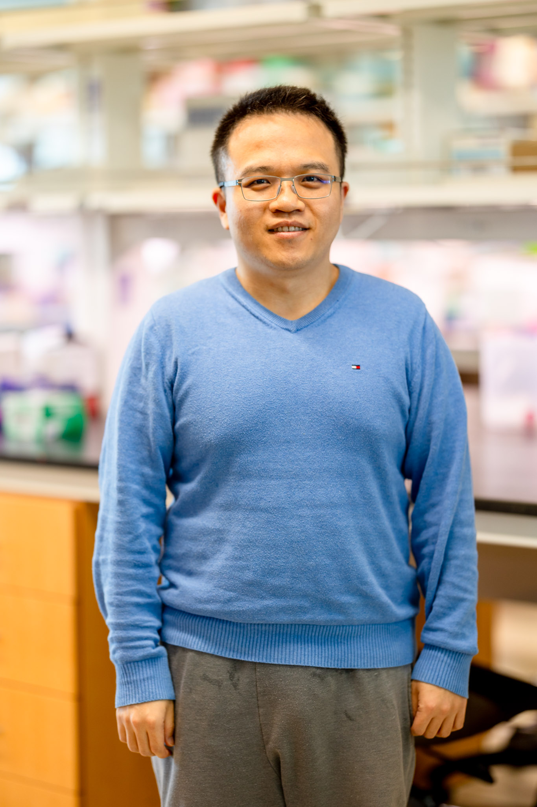

__Yung-Chun (David) Wang__,
Instructor

David earned a B.S. in Agriculture Chemistry from the National Taiwan University. He did his Ph.D. with Dr. Shiyou Chen studying the mechanism underlying the regulation of JAK3 in abdominal aortic aneurysm at the University of Georgia. David has received a prestigious Center of Regenerative Medicine Postdoctoral Fellowship. He is focused on genetic analyses and functional genomics of congenital hydrocephalus and cerebral palsy projects.

-----

### Graduate Students

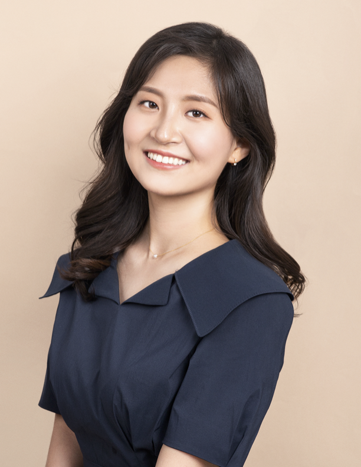

__Nahyun Kong__,
Ph.D. Candidate and Mogam Science Scholar/Precision Medicine Pathway Fellow (Human & Statistical Genetics)

Nahyun is a 5th-year Ph.D. student at Washington University in St. Louis. She earned her B.S. in Biological Sciences from the Korea Advanced Institute of Science and Technology. Her research focuses on developing novel methodologies to investigate the roles of uniparental disomy, mitochondrial genome variants, and somatic variants in both disease and normal states.

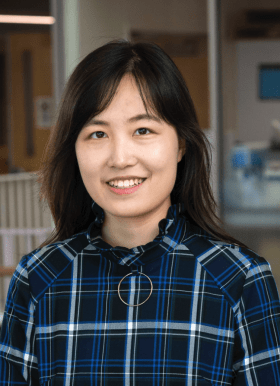

__Zitian Tang__,
Ph.D. Candidate and Precision Medicine Pathway Fellow (Biomedical Informatics & Data Science)

Zitian is a 4th-year PhD student at Washington University in St. Louis. She completed her BS in Biomedical Engineering and Computer Science at the Georgia Institute of Technology. She is developing computational strategies and tools to elucidate the impact of short tandem repeats and contribute to the somatic variation catalog for the Somatic Mosaicism Across Human Tissues consortium.

__Jenna Ulibarri__,
Ph.D. Candidate and T32 CMB/IMSD Fellow (Molecular Genetics and Genomics)

Jenna is a 4th-year PhD student at Washington University in St. Louis. She completed her BS in Biology at the University of New Mexico-Albuquerque. She is focusing on the development of computational and functional genomic strategies within the context of studying Proteogenomics in peripheral neuropathy.

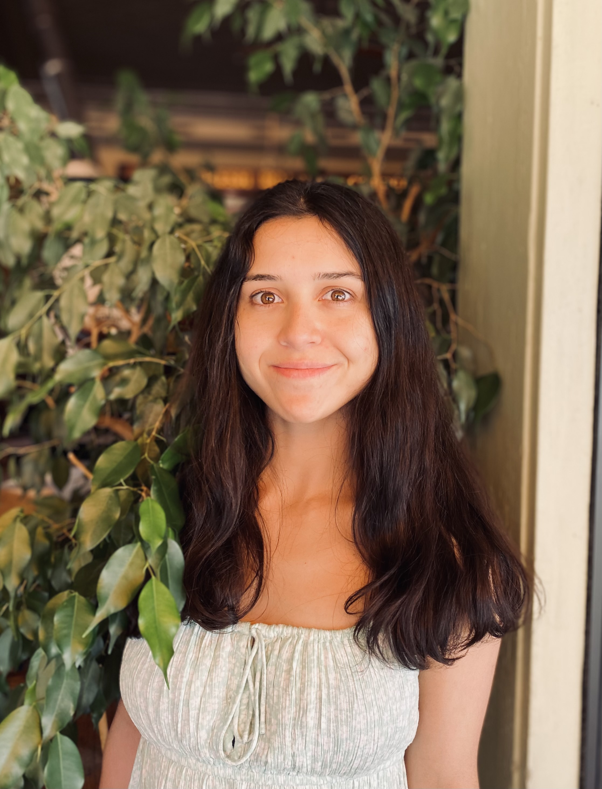

__Emma Casey__,
Ph.D. Student and T32 CMB/IMSD/NINDS Diversity Supplement/Precision Medicine Pathway Fellow (Molecular Genetics and Genomics)

Emma is a 3rd-year PhD student at Washington University in St. Louis. She earned her BS in Environmental Science from DePaul University, followed by a master's degree in Public Health from Emory University. Her research interests lie in utilization of human genetics and functional genomics to understand how mitochondrial and nuclear genomes influence the pathomechanisms of peripheral neuropathy and congenital hydrocephalus.

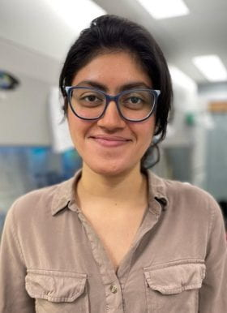

__Purva Patel__,
Ph.D. Student and Precision Medicine Pathway Fellow (Computational & Systems Biology)

Purva is a 3rd-year PhD student at Washington University in St. Louis. She earned her BS in Biology from University of Missouri-Columbia, followed by a master's degree in Bioinformatics from University of Missouri-Kansas City. Her research interests lie in utilization of human genetics and functional genomics to uncover the genetic underpinnings of congenital hydrocephalus.

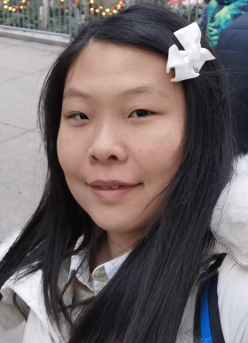

__Zefan (Vivien) Li__,
Ph.D. Student and Precision Medicine Pathway Fellow (Molecular Cell Biology)

Vivien is a 3rd-year PhD student at Washington University in St. Louis. She earned her BS in Biological Science from Peking University. Her research interests lie in utilization of human genetics and multi-omics genomics to uncover the genetic underpinnings of idiopathic peripheral neuropathy.

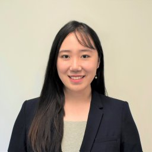

__Wendy Dong__,
MSTP Candidate and T32 GATP Fellow (Computational & Systems Biology)(Joint with Jeff Milbrandt)

Wendy is a 3rd-year MD/PhD student at Washington University in St. Louis. She completed her BS in Biomedical Engineering at the Duke University. She is co-mentored by Dr. Jeffery Milbrandt and Dr. Jin to elucidate comprehensive molecular/cellular phenotypes that underlie human pain transduction, transmission, and processing. 

-----

### Staff

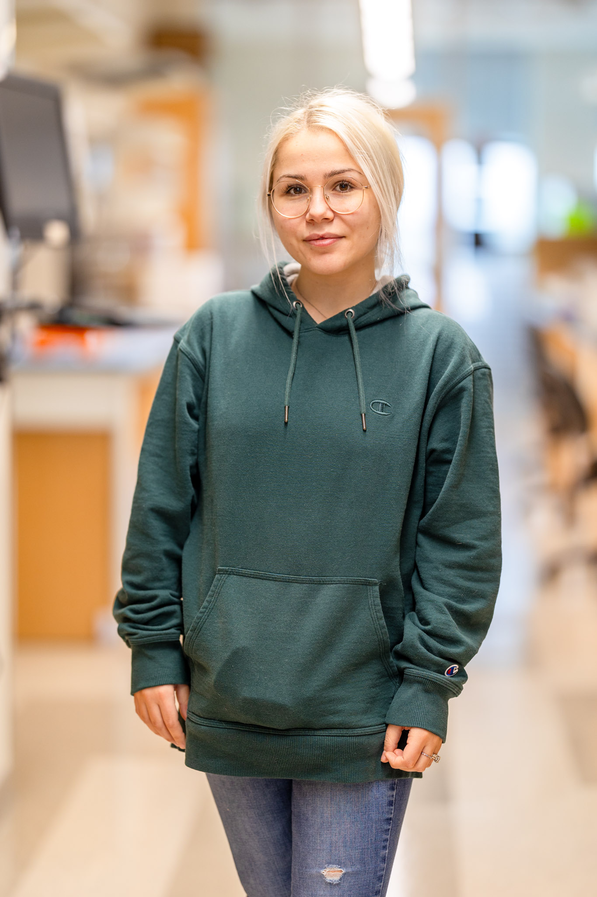

__Elvisa Mehinovic__,
Bioinformaticist 

Elle completed her M.S. in Biomedical Informatics & Data Science at Washington University. Her favorite hobbies include cuddling with her cat and drawing.  

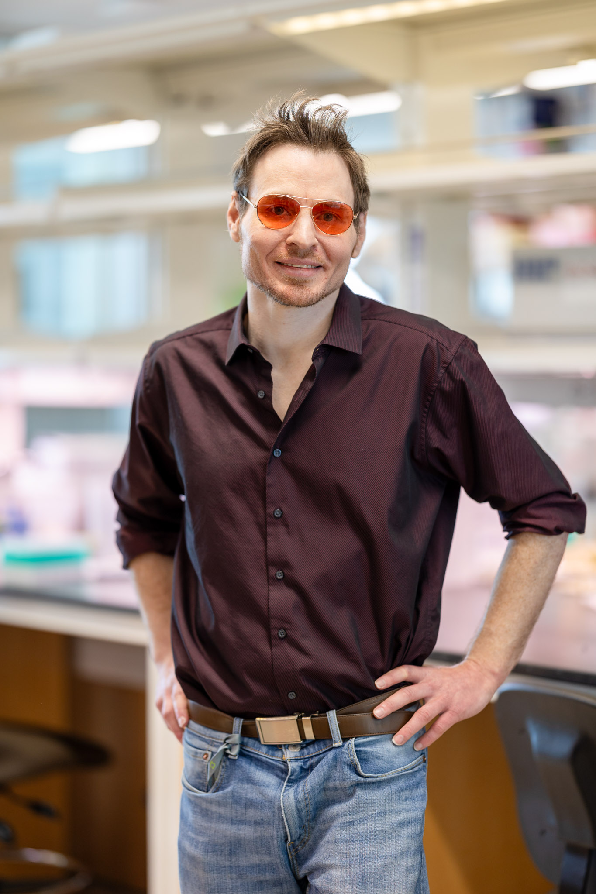

__Jason Bedwinek__,
Research Lab Supervisor

Jason earned his M.S. in biotechnologies at University of Missouri St. Louis. His main area of interest is nucleic acid chemistry, especially as it relates to sequencing technologies. His main focus is on using functional genomic assays to associate underlying genetic variants with neurological pathologies.

-----

### Rotation Students and Interns

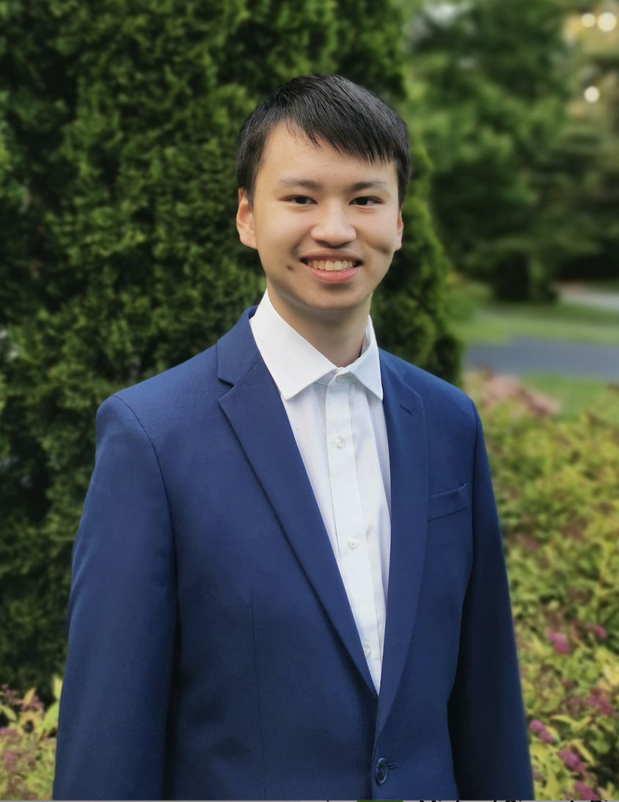

__Brian Yu__,
Undergraduate Student (U of Chicago Computer Science)

-----

### Lab Pets

__Ziggy__

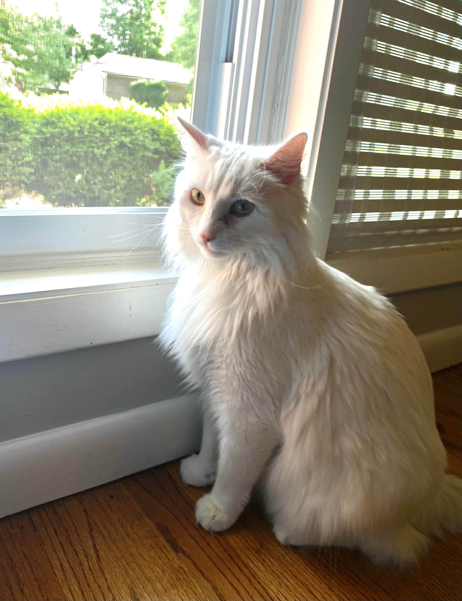

-----

### Alumni

#### *Graduate Students:*

__Shujuan Zhao__ - Graduate Student (Molecular Genetics and Genomics), 2020/09 - 2025/08

#### *Rotation Students:*

__Wilber Palma__ - Rotation Student (Molecular Genetics and Genomics), 2025/01 - 2025/04, currently graduate student in Mike Meers's lab.

__Sam Greenberg__ - Rotation Student (Molecular Genetics and Genomics), 2025/01 - 2025/03, currently graduate student in Priyanka Verma's lab.

__Yu Liu__ - Rotation Student (Molecular Cell Biology), 2024/10 - 2025/02, currently graduate student in Kelly Bolton's lab.

__Tingkuan Chu__ - Rotation Student (Molecular Genetics and Genomics), 2024/09 - 2024/11, currently graduate student in Jeffrey Milbrandt's lab.

__Qichen Fu__ - Rotation Student (Molecular Genetics and Genomics), 2023/11 - 2024/01, currently graduate student in Ting Wang's lab.

__Justin Chen__ - Rotation Student (Computational and Systems Biology), 2023/04 - 2023/07, currently graduate student in Ting Wang's lab.

__Yu-Liang Yeh__ - Rotation Student (Biomedical Informatics & Data Science), 2023/01 - 2023/04, currently graduate student in Michael Meers's lab.

__Ai Zhang__ - Rotation Student (Human & Statistical Genetics), 2022/09 - 2022/11; currently graduate student in Gautam Dantas's lab.

__Vincent Gillespie__ - Rotation Student (Molecular Genetics and Genomics), 2022/07 - 2022/09; currently graduate student in Gautam Dantas's lab.

__Yuxiao Xu__ - Rotation Student (WashU MSTP), 2022/05 - 2022/06; currently graduate student in Mayssa Mokalled's lab.

__Lei Lu__ - Rotation Student (Computer Science & Engineering), 2022/01 - 2022/02; currently graduate student at Northeastern University.

__Mariam Khanfar__ - Rotation Student (Human & Statistical Genetics), 2021/09 - 2021/12; currently graduate student in Malachi Griffith's lab.

__Kuangying Yang__ - Rotation Student (Human & Statistical Genetics), 2021/09 - 2021/12; currently graduate student in Angela Hirbe's lab.

__Julie Choi__ - Rotation Student (Human & Statistical Genetics), 2021/10 - 2021/12; currently graduate student in Jeffrey Milbrandt's lab.

__Prashant Kumar Kuntala__ - Rotation Student (Computational and Systems Biology), 2021/09 - 2021/11; currently graduate student in Ting Wang's lab.

__Changfeng Chen__ - Rotation Student (Molecular Cell Biology), 2021/02 - 2021/04; currently graduate student in Benjamin Humphreys's lab.

__Jian Ryou__ - Rotation Student (Human & Statistical Genetics), 2020/11 - 2021/02; currently graduate student in Gautam Dantas's lab.

#### *Undergraduate Students:*

__Andrew Ruttenberg__ - Undergraduate Student (WashU PreMed), 2022/09 - 2025/06; currently a PhD student at U of Toronto.

__Tugce Iyiyol__ - Undergraduate Student (WashU PreMed), 2022/08 - 2024/05

__Owen Limbrick__ - Undergraduate Student (WashU PreMed), 2024/09 - 2025/05

#### *Summer Interns:*

__Aria Ma__ - McDonnell Genome Institute OGR Summer Student, 2024/06 - 2024/08; currently a senior at Tufts University.

__Athziri Marcial Rodriguez__ - McDonnell Genome Institute OGR Summer Student, 2022/06 - 2022/08; currently a Physician-Scientist Kornfeld Post-Bac Scholar at WashU.

__Cabria Shelton__ - McDonnell Genome Institute OGR Summer Student, 2022/06 - 2022/08; currently a master's student at Wake Forest U.

__Max Wrubel__ - McDonnell Genome Institute OGR Post-Baccalaureate Extensive Study Student, 2021/11 - 2022/07; currrently bioinformatician in Alison Goate's lab at Mount Sinai.

__Kareena Joshipura__ - Mount Holyoke College's Lynk Fellow, 2021/04 - 2021/09; currently a software engineer at Capgemini.

#### *Staff:*

__Po-Ying Fu__ - Bioinformaticist, 2020/06 - 2023/04, currently data engineer at the Cathay United Bank.

__Devin Qiu__ - Research Assistant, 2022/07 - 2022/12; currently a PhD students at Van Andel Institute.

#### *Master's Students:*

__Xiaobing (Dean) Yu__ - Master's student (Computer Science & Engineering), 2021/03 - 2021/11; currently graduate student in Aristeidis Sotiras's lab.

__Sam Peters__ - Master's student (Bioinformatics and Computational Biology at SLU), 2020/05 - 2021/04; currently research specialist at the McDonnell Genome Institute.

__Spencer King__ - Master's student (Computer Science & Engineering), 2020/05 - 2021/05; currently data scientist at Geneoscopy.

