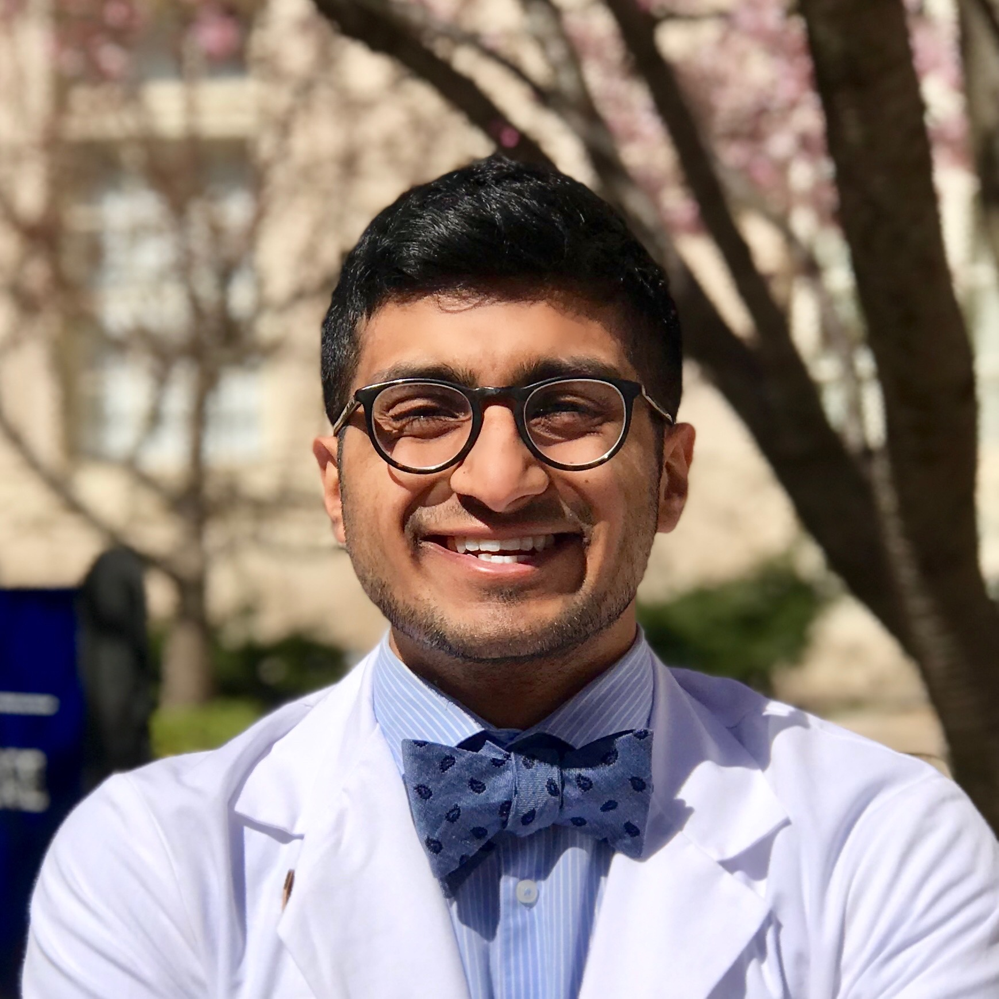

### Principal Investigator

__Sheng Chih (Peter) Jin__

Peter is Assistant Professor of Genetics and Pediatrics at the Washington University School of Medicine. He is interested in understanding how genetic variation affects disease biology and using genetic and genomic analyses to infer the molecular mechanisms underlying cardiovascular and neurodevelopmental diseases. His full CV is available [here](files/sjin-CV-06-25-2020-Detailed-Format.pdf).

*NIH Grants*

* R00HL143036: Integrative Genomic Analysis of Congenital Heart Disease (Role: PI) (Active)
* R01NS111029: Human Genetics and Molecular Mechanisms of Congenital Hydrocephalus (Role: Co-Investigator) (Active)
* R01AR067715: Genetic Risk Factors for Severe Scoliosis (Role: Co-Investigator) (Funded)
* R01: Human Genetics and Molecular Mechanisms of Vein of Galen Aneurysmal Malformation (Role: Co-Investigator) (within payline after review)   

*Selected Honors and Awards*

* K99/R00 Pathway to Independence Award, NHLBI, NIH
* American Heart Association Postdoctoral Fellowship
* James Hudson Brown – Alexander B. Coxe Fellowship, Yale School of Medicine
* Howard Hughes Medical Institute Postdoctoral Fellowship, Howard Hughes Medical Institute at Yale School of Medicine
* Fellow, Lucille P. Markey Special Emphasis Pathway in Human Pathobiology, Markey Foundation, Washington University School of Medicine

-----

### Postdoctoral Researchers and Fellows

***This could be you***

-----

### Graduate Students

__Amar Sheth__,
MD Student, Yale School of Medicine

Amar is a 2nd year medical student at Yale with a background in developmental neuroscience and computer science. His broader research aim is to harness our current understanding of spatiotemporal genetics of the brain to discover mechanisms of neurological dysfunction.

__Duy Phan__,
MD/Ph.D. Student, Yale School of Medicine

Duy graduated with a B.S. in Neuroscience in 2018 from Johns Hopkins University, where he was a Barry M. Goldwater Scholar, Woodrow Wilson Research Fellow, HHMI Scholar, and NIH Research Fellow. He is interested in the molecular genetic mechanisms of neural development and the pathogenesis of primary and acquired central nervous system maldevelopment. 

__Weilai Dong__,
Ph.D. Candidate, Yale School of Medicine

Weilai graduate with a B.S. in Biology in 2015 from the Zhejiang University. She was awarded a prestigious pre-doctoral fellowship from the American Heart Association. She is interested in using genomics and human genetics to identify causes of congenital disorders and cancer.

-----

### Staff

__Po-Ying Fu__,
Bioinformatics Research Analyst, Washington University in St. Louis 

Po-Ying obtained her master's degree in microbiology specialized in bioinformatics from Soochow University. In her master's thesis, she performed genomics analysis and used cell biology approaches to reveal the anti-cancer ability of lipopolysaccharide binding peptides. To advance her programming skills, she completed several advanced computer science courses at 42 Silicon Valley (a software engineering school) and Ohlong College.  She loves cycling and traveling!

### Rotation Students and Interns

__Spencer King__,
M.Sc. Student, Washington University in St. Louis

Spencer graduated with a B.S. in Computer Science and Engineering from the University of Notre Dame in 2016. He has held multiple jobs in healthcare and is interested in the application of machine learning techniques to the medical field.

__Sam Peters__,
M.Sc. Student, Saint Louis University

Sam graduated with a B.S. in Biology from the Southern Illinois University Edwardsville. He is interested in implementing efficient bioinformatic pipelines, increasing efficiencies of ones already in place, and visualizing large datasets in a high-throughput manner by creating efficient code. He has a passion for homebrewing and baking bread.

-----
