### Principal Investigator

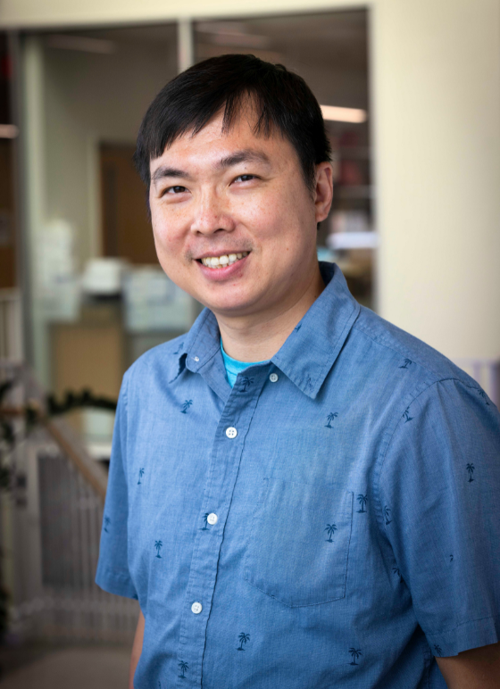

__Sheng Chih (Peter) Jin__

Peter is Assistant Professor of Genetics and Pediatrics at the Washington University School of Medicine. He is interested in understanding how genetic variation affects disease biology and using genetic and genomic analyses to infer the molecular mechanisms underlying neurodevelopmental and cardiovascular diseases.

*NIH Grants*

* R01NS131610: Molecular and Cellular Characterization of Congenital Hydrocephalus (Role: PI)(Active)
* U19NS130607: INTERCEPT: Integrated Research Center for Human Pain Tissues (Role: Project 1 Co-PI and Data Core PI) (Active)
* UM1DA058219: WashU-VAI Somatic Mosaicism across Human Tissues (SMaHT) Program Genome Characterization Center (Role: Co-Investigator) (Active)
* U24NS132103: WashU Somatic Mosaicism across Human Tissues (SMaHT) Program. Organizational Center (Role: Co-Investigator) (Active)
* R01NS127108: Genomic analysis of the Multiplex, Autozygous Populations in Cerebral Palsy (MAP CP) cohort: a focused approach to a complex disease (Role: Co-Investigator) (Active)

*Selected Honors and Awards*

* NIH Early Career Reviewer Program, 2023
* Pediatric Cardiac Genomics Consortium and Cardiovascular Development Data Resource Center Challenge Prize, 2022
* Cerebral Palsy Alliance Research Foundation Project Grant, 2022-2027 
* Hydrocephalus Association Innovator Award, 2021
* Children's Discovery Institute Faculty Scholar, 2021-2026
* Children’s Discovery Institute Zebrafish Models for Pediatric Research Services Cooperative Micro-Grant Award, 2021
* Washington University Institute of Clinical and Translational Research Funding Program Award, 2020
* K99/R00 Pathway to Independence Award, NHLBI, NIH
* American Heart Association Postdoctoral Fellowship
* James Hudson Brown – Alexander B. Coxe Fellowship, Yale School of Medicine
* Howard Hughes Medical Institute Postdoctoral Fellowship, Howard Hughes Medical Institute at Yale School of Medicine
* Fellow, Lucille P. Markey Special Emphasis Pathway in Human Pathobiology, Markey Foundation, Washington University School of Medicine

-----

### Graduate Students

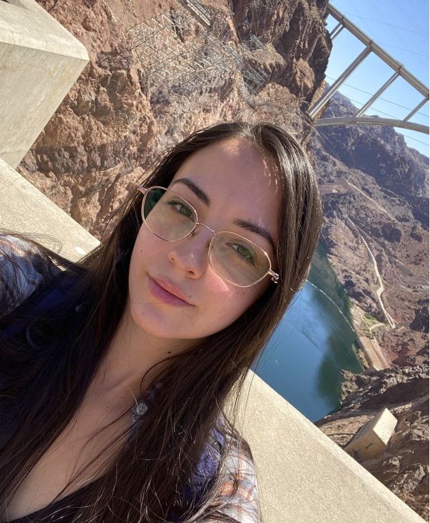

__Jenna Ulibarri__,
Ph.D. Candidate and T32 CMB/IMSD Fellow (Molecular Genetics and Genomics)

Jenna is a 5th-year PhD student at Washington University in St. Louis. She completed her BS in Biology at the University of New Mexico-Albuquerque. She is focusing on the development of computational and functional genomic strategies within the context of studying Proteogenomics in peripheral neuropathy.

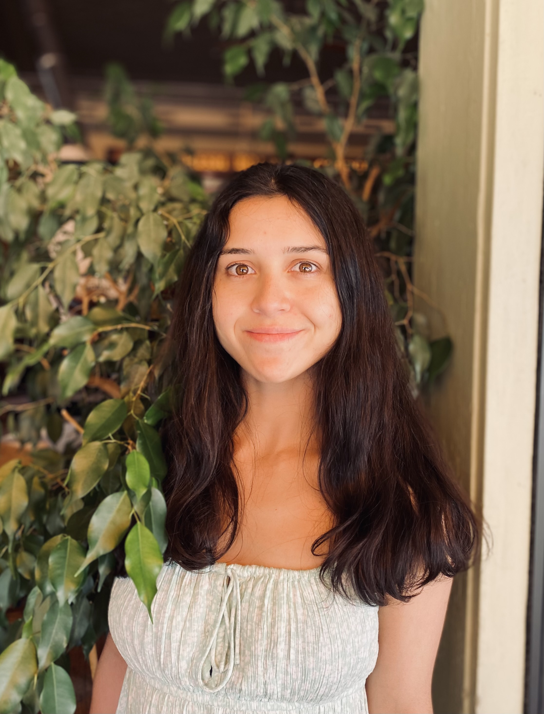

__Emma Casey__,
Ph.D. Student and T32 CMB/T32 IMSD/NINDS Diversity Supplement/Precision Medicine Pathway Fellow (Molecular Genetics and Genomics)

Emma is a 4th-year PhD student at Washington University in St. Louis. She earned her BS in Environmental Science from DePaul University, followed by a master's degree in Public Health from Emory University. Her research interests lie in utilization of human genetics and functional genomics to understand how mitochondrial and nuclear genomes, and their interactions, shape the molecular mechanisms of cerebral palsy and normal human tissue development.

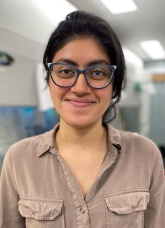

__Purva Patel__,
Ph.D. Student and Precision Medicine Pathway Fellow (Computational & Systems Biology)

Purva is a 4th-year PhD student at Washington University in St. Louis. She earned her BS in Biology from University of Missouri-Columbia, followed by a master's degree in Bioinformatics from University of Missouri-Kansas City. Her research interests lie in utilization of human genetics and functional genomics to uncover the genetic underpinnings of congenital hydrocephalus.

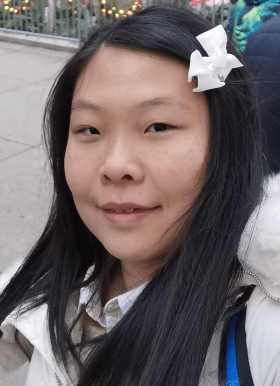

__Zefan (Vivien) Li__,
Ph.D. Student and Pivot 314/Precision Medicine Pathway Fellow (Molecular Cell Biology)

Vivien is a 4th-year PhD student at Washington University in St. Louis. She earned her BS in Biological Science from Peking University. Her research interests lie in utilization of human genetics and multi-omics genomics to uncover the genetic underpinnings of idiopathic peripheral neuropathy.

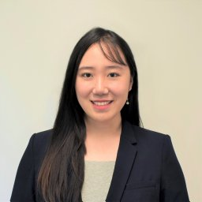

__Wendy Dong__,
MSTP Candidate and T32 GATP Fellow (Computational & Systems Biology)(Joint with Jeff Milbrandt)

Wendy is a 4th-year MD/PhD student at Washington University in St. Louis. She completed her BS in Biomedical Engineering at the Duke University. She is co-mentored by Dr. Jeffery Milbrandt and Dr. Jin to elucidate comprehensive molecular/cellular phenotypes that underlie human pain transduction, transmission, and processing. 

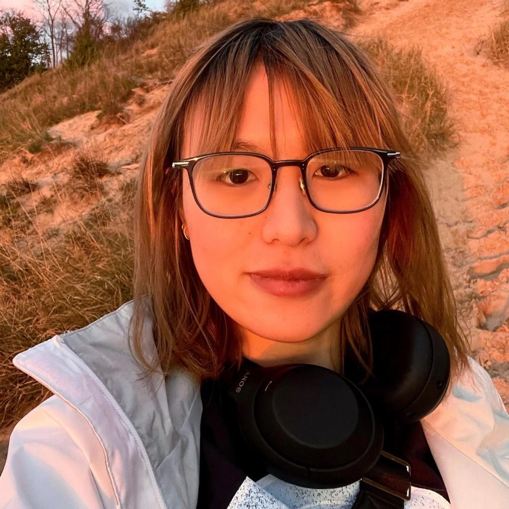

__Yijia Wu__,
Ph.D. Student and Precision Medicine Pathway Fellow (Molecular Genetics and Genomics)

Yijia is a 2nd-year PhD student at Washington University in St. Louis. She earned her BS in Chemistry from the Nanjing Unversity of Finance & Economics, followed by a master's degree in Biochemistry from Case Western Reserve University. Her research interests lie in utilization of human genetics and functional genomics to understand the role of short tandem repeats in peripheral neuropathy and amyotrophic lateral sclerosis. 

-----

### Staff

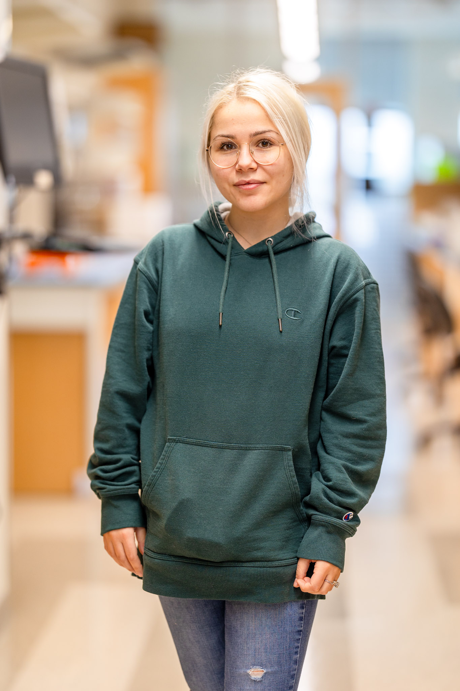

__Elvisa Mehinovic__,
Bioinformaticist 

Elle completed her M.S. in Biomedical Informatics & Data Science at Washington University. Her favorite hobbies include cuddling with her cat and drawing.  

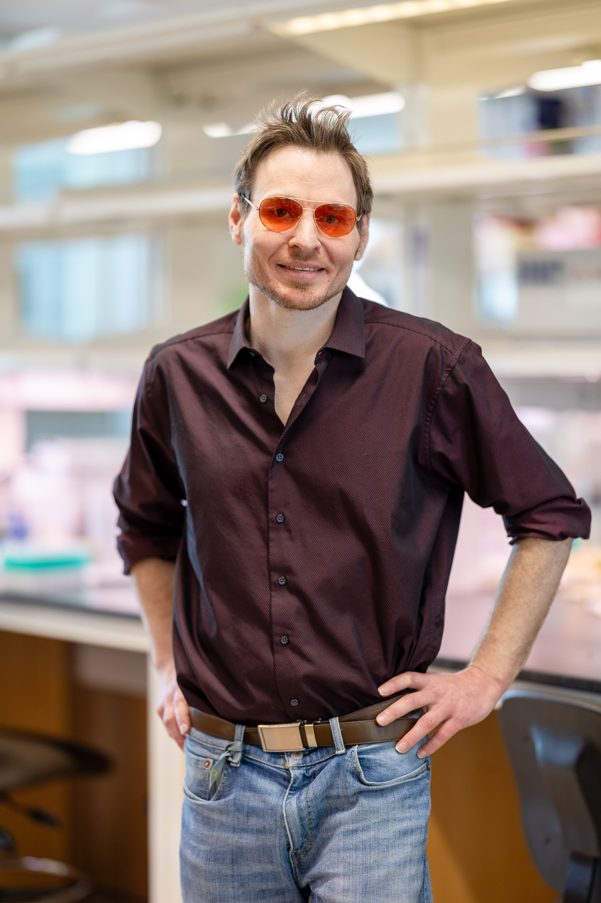

__Jason Bedwinek__,
Research Lab Supervisor

Jason earned his M.S. in biotechnologies at University of Missouri St. Louis. His main area of interest is nucleic acid chemistry, especially as it relates to sequencing technologies. His main focus is on using functional genomic assays to associate underlying genetic variants with neurological pathologies.

-----

### Rotation Students and Interns

__Juichen Lu__,
Rotation Student (Molecular Cell Biology)

__Cynthia Zhang__,
Rotation Student (Computational and Systems Biology)

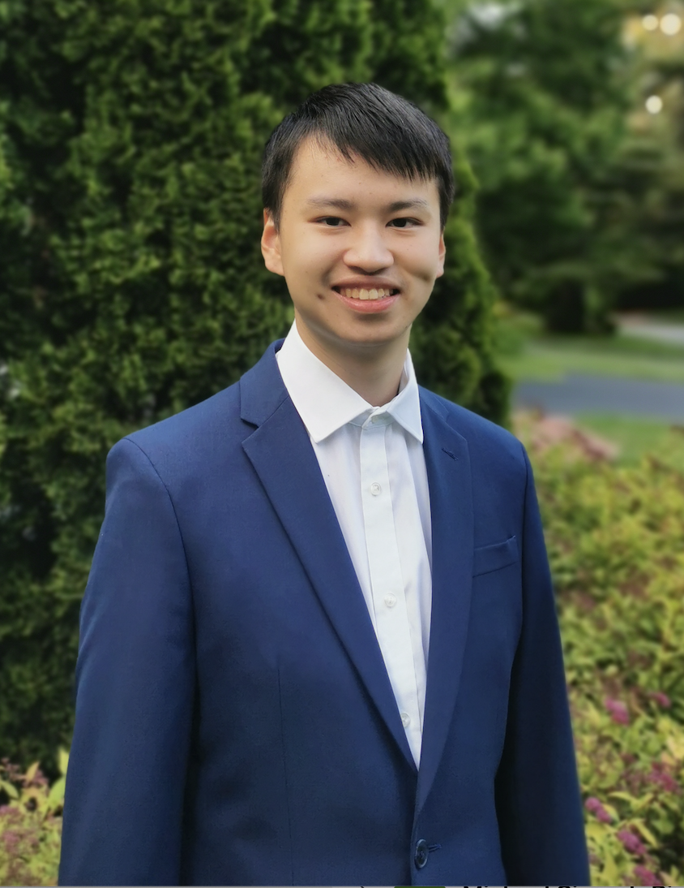

__Brian Yu__,
Undergraduate Student (U of Chicago Computer Science)

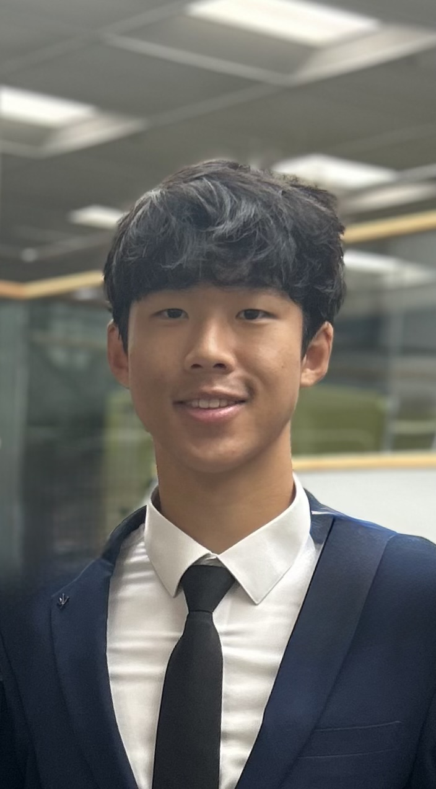

__Jack Yu__,
Undergraduate Student and SURGE Fellow (Washington University Biology & Computer Science)

-----

### Lab Pets

__Ziggy__

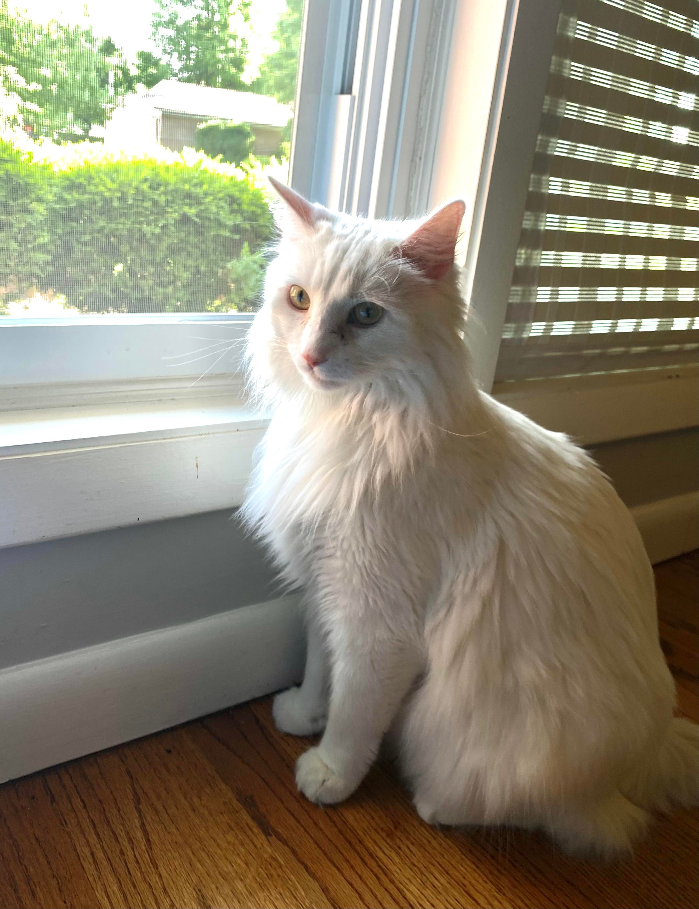

-----

### Alumni

#### Faculty, Postdoctoral Researchers and Staff Scientists

__Yung-Chun (David) Wang__ - Postdoc and then Instructor, 2021/07 - 2026/06

#### *Graduate Students:*

__Zitian Tang__ - Graduate Student (Biomedical Informatics & Data Science), 2023/05 - 2026/08

__Nahyun Kong__ - Graduate Student (Human and Statistical Genetics), 2022/01 - 2026/08

__Julie Choi__ - Graduate Student (Molecular Genetics and Genomics), 2022/01 - 2025/07

__Shujuan Zhao__ - Graduate Student (Molecular Genetics and Genomics), 2020/09 - 2025/08

#### *Rotation Students:*

__Cassia Williams-Rogers__ - Rotation Student (WashU MSTP), 2026/01 - 2026/02

__Wilber Palma__ - Rotation Student (Molecular Genetics and Genomics), 2025/01 - 2025/04

__Sam Greenberg__ - Rotation Student (Molecular Genetics and Genomics), 2025/01 - 2025/03

__Yu Liu__ - Rotation Student (Molecular Cell Biology), 2024/10 - 2025/02

__Tingkuan Chu__ - Rotation Student (Molecular Genetics and Genomics), 2024/09 - 2024/11

__Qichen Fu__ - Rotation Student (Molecular Genetics and Genomics), 2023/11 - 2024/01

__Justin Chen__ - Rotation Student (Computational and Systems Biology), 2023/04 - 2023/07

__Yu-Liang Yeh__ - Rotation Student (Biomedical Informatics & Data Science), 2023/01 - 2023/04

__Ai Zhang__ - Rotation Student (Human & Statistical Genetics), 2022/09 - 2022/11

__Vincent Gillespie__ - Rotation Student (Molecular Genetics and Genomics), 2022/07 - 2022/09

__Yuxiao Xu__ - Rotation Student (WashU MSTP), 2022/05 - 2022/06

__Lei Lu__ - Rotation Student (Computer Science & Engineering), 2022/01 - 2022/02

__Mariam Khanfar__ - Rotation Student (Human & Statistical Genetics), 2021/09 - 2021/12

__Kuangying Yang__ - Rotation Student (Human & Statistical Genetics), 2021/09 - 2021/12

__Prashant Kumar Kuntala__ - Rotation Student (Computational and Systems Biology), 2021/09 - 2021/11

__Changfeng Chen__ - Rotation Student (Molecular Cell Biology), 2021/02 - 2021/04

__Jian Ryou__ - Rotation Student (Human & Statistical Genetics), 2020/11 - 2021/02

#### *Undergraduate Students:*

__Andrew Ruttenberg__ - Undergraduate Student (WashU PreMed), 2022/09 - 2025/06

__Tugce Iyiyol__ - Undergraduate Student (WashU PreMed), 2022/08 - 2024/05

__Owen Limbrick__ - Undergraduate Student (WashU PreMed), 2024/09 - 2025/05

#### *Summer Interns:*

__Aria Ma__ - McDonnell Genome Institute OGR Summer Student, 2024/06 - 2024/08

__Athziri Marcial Rodriguez__ - McDonnell Genome Institute OGR Summer Student, 2022/06 - 2022/08

__Cabria Shelton__ - McDonnell Genome Institute OGR Summer Student, 2022/06 - 2022/08

__Max Wrubel__ - McDonnell Genome Institute OGR Post-Baccalaureate Extensive Study Student, 2021/11 - 2022/07

__Kareena Joshipura__ - Mount Holyoke College's Lynk Fellow, 2021/04 - 2021/09

#### *Staff:*

__Po-Ying Fu__ - Bioinformaticist, 2020/06 - 2023/04

__Devin Qiu__ - Research Assistant, 2022/07 - 2022/12

#### *Master's Students:*

__Xiaobing (Dean) Yu__ - Master's student (Computer Science & Engineering), 2021/03 - 2021/11

__Sam Peters__ - Master's student (Bioinformatics and Computational Biology at SLU), 2020/05 - 2021/04

__Spencer King__ - Master's student (Computer Science & Engineering), 2020/05 - 2021/05

