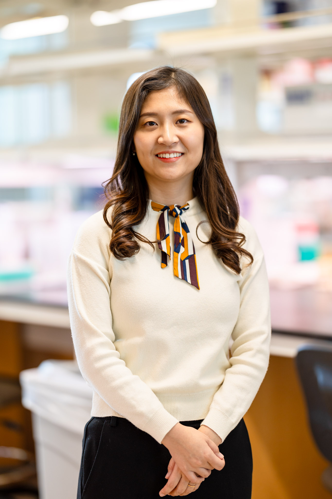
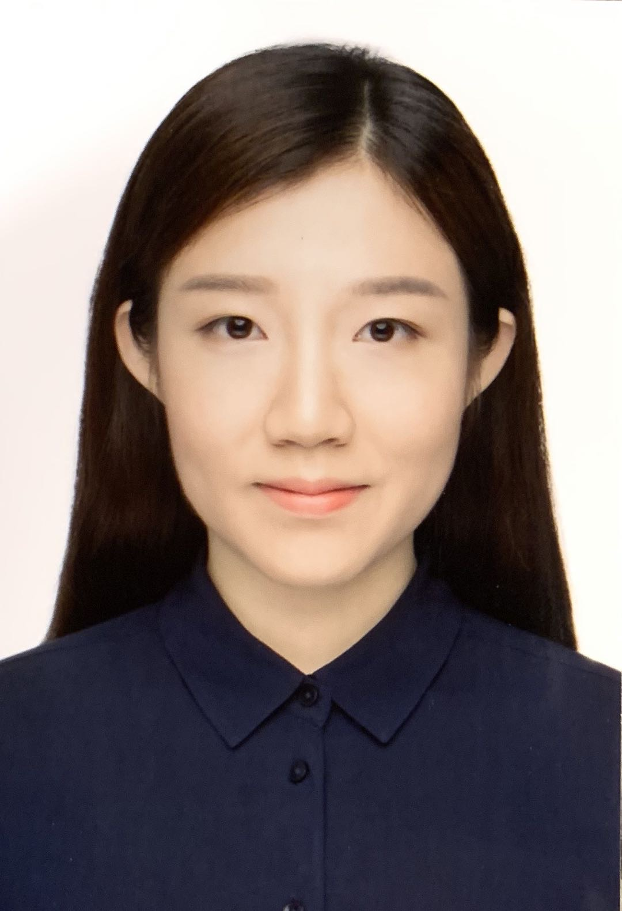

### Principal Investigator

__Sheng Chih (Peter) Jin__

Peter is Assistant Professor of Genetics and Pediatrics at the Washington University School of Medicine. He is interested in understanding how genetic variation affects disease biology and using genetic and genomic analyses to infer the molecular mechanisms underlying neurodevelopmental and cardiovascular diseases. His full CV is available [here](files/CV-WUSM-CV-format-08-16-2022.pdf).

*NIH Grants*

* U19NS130607: INTERCEPT: Integrated Research Center for Human Pain Tissues (Role: Project 1 Co-PI and Data Core Co-PI) (Active)
* R00HL143036: Integrative Genomic Analysis of Congenital Heart Disease (Role: PI) (Active)
* R01NS111029: Human Genetics and Molecular Mechanisms of Congenital Hydrocephalus (Role: Co-Investigator) (Active)
* R01AR067715: Genetic Risk Factors for Severe Scoliosis (Role: Co-Investigator) (Active)
* R01NS117609: Human Genetics and Molecular Mechanisms of Vein of Galen Aneurysmal Malformation (Role: Co-Investigator) (Active)   

*Selected Honors and Awards*

* Cerebral Palsy Alliance Research Foundation Project Grant, 2022-2027 
* Hydrocephalus Association Innovator Award, 2021
* Children's Discovery Institute Faculty Scholar, 2021-2026
* Children’s Discovery Institute Zebrafish Models for Pediatric Research Services Cooperative Micro-Grant Award, 2021
* Washington University Institute of Clinical and Translational Research Funding Program Award, 2020
* K99/R00 Pathway to Independence Award, NHLBI, NIH
* American Heart Association Postdoctoral Fellowship
* James Hudson Brown – Alexander B. Coxe Fellowship, Yale School of Medicine
* Howard Hughes Medical Institute Postdoctoral Fellowship, Howard Hughes Medical Institute at Yale School of Medicine
* Fellow, Lucille P. Markey Special Emphasis Pathway in Human Pathobiology, Markey Foundation, Washington University School of Medicine

-----

### Postdoctoral Researchers and Fellows

__Yung-Chun (David) Wang__,
Center of Regenerative Medicine Postdoctoral Fellow

David earned a B.S. in Agriculture Chemistry from the National Taiwan University. He did his Ph.D. with Dr. Shiyou Chen studying the mechanism underlying the regulation of JAK3 in abdominal aortic aneurysm at the University of Georgia. David has received a prestigious Center of Regenerative Medicine Postdoctoral Fellowship. He is focused on genetic analyses and functional genomics of congenital hydrocephalus and cerebral palsy projects.

-----

### Graduate Students

__Shujuan Zhao__,
Ph.D. Candidate and Markey Pathway Fellow (Molecular Genetics and Genomics)(Joint with Kris Kahle at MGH)

Shujuan is a 4th year Ph.D. student at Washington University in St. Louis. She completed her BS in Pharmaceutical Engineering at the Central South University. She is working with Dr. Jin and Dr. Kahle at Massachusetts General Hospital to figure out the genetic etiology and molecular mechanisms of Vein of Galen aneurysmal malformation and Moyamoya disease.

__Julie Choi__,
Ph.D. Candidate and T32 GATP/Precision Medicine Pathway Fellow (Human & Statistical Genetics)(Joint with Jeff Milbrandt)

Julie is a 2nd year Ph.D. student at Washington University in St. Louis. She completed her BS in Biology and Public Health at the University of Texas at Austin. She is working with Dr. Jin and Dr. Jeff Milbrandt to figure out the genetic etiology and molecular mechanisms of hereditary neuropathy. 

__Nahyun Kong__,
Ph.D. Student and Precision Medicine Pathway Fellow (Human & Statistical Genetics)

Nahyun is a 2nd year Ph.D. student at Washington University in St. Louis. She completed her BS in Biological Sciences at the Korea Advanced Institute of Science and Technology. She is developing genomic apporaches to figure out the genetic etiology and molecular mechanisms of rare movement disorders.

-----

### Staff

__Po-Ying Fu__,
Bioinformatics Research Analyst 

Po-Ying obtained her master's degree in microbiology specialized in bioinformatics from Soochow University. In her master's thesis, she performed genomics analysis and used cell biology approaches to reveal the anti-cancer ability of lipopolysaccharide binding peptides. To advance her programming skills, she completed several advanced computer science courses at 42 Silicon Valley (a software engineering school) and Ohlong College.  She loves cycling and traveling!

__Devin Qiu__,
Research Assistant

Devin obtained his first master's degree in Plant Biotechnology from Cornell University and his second master's degree in Biomedical Informatics from Washington Univeristy in St. Louis. During his master's study at WashU, he performed single-cell RNA-sequencing genomic analysis to define genomic profile of lung stromal and immune cells in post-viral lung disease and build a risk evaluation model to predict the effect of chronic kidney disease history, comorbidities, and other demographic factos on the severity of COVID-19 patients. He loves playing video games.

-----

### Rotation Students and Interns

__Ai Zhang__,
Rotation Student (Human & Statistical Genetics)

__Jenna Ulibarri__,
Rotation Student (Molecular Genetics and Genomics)

__Tugce Iyiyol__,
Undergraduate Student (WashU PreMed)

__Andrew Ruttenberg__,
Undergraduate Student (WashU PreMed)

-----

### Lab Pets

__Ziggy__

-----

### Alumni

__Vincent Gillespie__ - Rotation Student (Molecular Genetics and Genomics), 2022/07 - 2022/10 

__Athziri Marcial Rodriguez__ - McDonnell Genome Institute OGR Summer Student, 2022/06 - 2022/08; currently a rising junior at St. Olaf College.

__Cabria Shelton__ - McDonnell Genome Institute OGR Summer Student, 2022/06 - 2022/08; currently a senior Health Equity major at Rhodes College.

__Max Wrubel__ - McDonnell Genome Institute OGR Post-Baccalaureate Extensive Study Student, 2021/11 - 2022/07; currrently bioinformatician in Alison Goate lab at Mount Sinai.

__Yuxiao Xu__ - Rotation Student (WashU MSTP), 2022/05 - 2022/06

__Wendy Dong__ - Rotation Student (WashU MSTP), 2022/05 - 2022/06

__Lei Lu__ - Rotation Student (Computer Science & Engineering), 2022/01 - 2022/02; currently graduate student at Northeastern University.

__Mariam Khanfar__ - Rotation Student (Human & Statistical Genetics), 2021/09 - 2021/12; currently graduate student in Malachi Griffith's lab.

__Kuangying Yang__ - Rotation Student (Human & Statistical Genetics), 2021/09 - 2021/12; currently graduate student in Angela Hirbe's lab.

__Xiaobing (Dean) Yu__ - Master's student (Computer Science & Engineering), 2021/03 - 2021/11; currently Master's student at WashU.

__Prashant Kumar Kuntala__ - Rotation Student (Computational and Systems Biology), 2021/09 - 2021/11; currently graduate student in Ting Wang's lab. 

__Kareena Joshipura__ - Mount Holyoke College's Lynk Fellow, 2021/04 - 2021/09; currently a software engineer at Capgemini.

__Changfeng Chen__ - Rotation Student (Molecular Cell Biology), 2021/02 - 2021/04; currently graduate student in Brian Laidlaw's lab.

__Jian Ryou__ - Rotation Student (Human & Statistical Genetics), 2020/11 - 2021/02; currently graduate student in Gautam Dantas's lab.

__Sam Peters__ - Master's student (Bioinformatics and Computational Biology at SLU), 2020/05 - 2021/04; currently Master's student at SLU.

__Spencer King__ - Master's student (Computer Science & Engineering), 2020/05 - 2021/05; currently data scientist at Geneoscopy.

__Shohaib Shaffiey__ - Master's student (Computer Science & Engineering), 2021/02 - 2021/05; currently Master's student at WashU.

