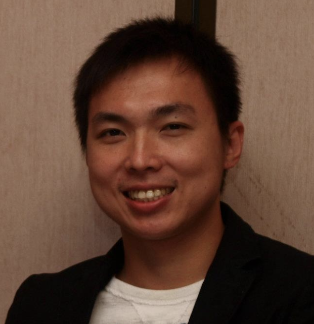

### Principal Investigator

__Sheng Chih (Peter) Jin__

Peter is Assistant Professor of Genetics and Pediatrics at the Washington University School of Medicine. He is interested in understanding how genetic variation affects disease biology and using genetic and genomic analyses to infer the molecular mechanisms underlying neurodevelopmental and cardiovascular diseases. His full CV is available [here](files/CV-WUSM-CV-format-01-03-2021.pdf).

*NIH Grants*

* R00HL143036: Integrative Genomic Analysis of Congenital Heart Disease (Role: PI) (Active)
* R01NS111029: Human Genetics and Molecular Mechanisms of Congenital Hydrocephalus (Role: Co-Investigator) (Active)
* R01AR067715: Genetic Risk Factors for Severe Scoliosis (Role: Co-Investigator) (Active)
* R01NS117609: Human Genetics and Molecular Mechanisms of Vein of Galen Aneurysmal Malformation (Role: Co-Investigator) (Active)   

*Selected Honors and Awards*

* K99/R00 Pathway to Independence Award, NHLBI, NIH
* American Heart Association Postdoctoral Fellowship
* James Hudson Brown – Alexander B. Coxe Fellowship, Yale School of Medicine
* Howard Hughes Medical Institute Postdoctoral Fellowship, Howard Hughes Medical Institute at Yale School of Medicine
* Fellow, Lucille P. Markey Special Emphasis Pathway in Human Pathobiology, Markey Foundation, Washington University School of Medicine

-----

### Postdoctoral Researchers and Fellows

***This could be you***

-----

### Graduate Students

__Shujuan Zhao__,
Ph.D. Candidate (Chemistry), Washington University in St. Louis

Shujuan is a 2nd year Ph.D. student at Washington University in St. Louis with a background in biochemistry and nuclear magnetic resonance. She is working with Dr. Jin and Dr. Kahle at Yale to figure out the genetic etiology and molecular mechanisms of Vein of Galen aneurysmal malformation and Moyamoya disease.

__Amar Sheth__,
MD Student, Yale School of Medicine

Amar is currently between his 3rd and 4th years of medical school at Yale. He has a background in developmental neuroscience and computer science. His broader research aim is to harness our current understanding of spatiotemporal genetics of the brain to discover mechanisms of neurological dysfunction. 

__Duy Phan__,
MD/Ph.D. Student, Yale School of Medicine

Duy graduated with a B.S. in Neuroscience in 2018 from Johns Hopkins University, where he was a Barry M. Goldwater Scholar, Woodrow Wilson Research Fellow, HHMI Scholar, and NIH Research Fellow. He is interested in the molecular genetic mechanisms of neural development and the pathogenesis of primary and acquired central nervous system maldevelopment. 

__Spencer King__,
M.Sc. Student (Computer Science), Washington University in St. Louis

Spencer graduated with a B.S. in Computer Science and Engineering from the University of Notre Dame in 2016. He has held multiple jobs in healthcare and is interested in the application of machine learning techniques to the medical field.

__Xiaobing (Dean) Yu__,
M.Sc. Student (Computer Science), Washington University in St. Louis

Xiaobing graduated with a B.S in Computer Science and Engineering from the Miami University. He is interested in applying natural language processing and deep learning techniques to process high dimensional biomedical data.

__Shohaib Shaffiey__,
M.Sc. Student (Computer Science), Washington University in St. Louis

Shohaib is currently an M.Sc. Student in Computer Science at Washington University in St. Louis. He graduated with a BS in Biological Engineering from the University of Missouri - Columbia and with a M.Sc. in Bioinformatics from Johns Hopkins University.  He's interested in applying linear and non-linear dimensionality reduction techniques to preprocess high dimensional genomic data sets so that machine learning techniques can be better applied to them.  He's also interested in applying Machine Learning algorithms on genomic and proteomic data to predict gene expression, protein structure and function, phylogenetic tree formation, coding, non-coding, and regulatory regions of genes.

-----

### Staff

__Po-Ying Fu__,
Bioinformatics Research Analyst, Washington University in St. Louis 

Po-Ying obtained her master's degree in microbiology specialized in bioinformatics from Soochow University. In her master's thesis, she performed genomics analysis and used cell biology approaches to reveal the anti-cancer ability of lipopolysaccharide binding peptides. To advance her programming skills, she completed several advanced computer science courses at 42 Silicon Valley (a software engineering school) and Ohlong College.  She loves cycling and traveling!

-----

### Rotation Students and Interns

__Kesava Viswanadha__,
Summer Intern

Kesava is currently a senior in high school. He is very interested in exploring the convergence of computer science and medicine, and this interest can be seen through his activities and awards in high school. He's consistently participated in competitions like the Brain Bee (multiple time finalist) and CyberPatriot (Top 12 Nationally), and been involved in several Data Science internships. Having exhausted his high school's computer science classes, he's taken numerous computer science courses at his local community college. He's been admitted to top engineering programs for undergrad and he's currently deciding where he should go. He loves recreationally playing basketball and biking!

__Kareena Joshipura__,
Summer Intern

Kareena is a rising senior at Mount Holyoke College, studying Statistics and Biology. Her passion to pursue these interdisciplinary subjects culminated in a course she took last year that applied probabilistic disease modeling to the current COVID-19 pandemic. She is working on an independent project that explores the impact invasive species have on native lands. On campus, Kareena is the captain of the South Asian dance team that participates in inter-collegiate events.She is also an executive board member of a sub-committee of the Student Government Association that works closely with students and faculty for the enhancement of student life on campus. Outside of coursework, Kareena spends her time watching videos on ‘How Things Work’ and being outdoors with her friends.

-----

### Alumni

__Changfeng Chen__ - Rotation Student (Molecular Cell Biology), 2021/02 - 2021/04

__Jian Ryou__ - Rotation Student (Human & Statistical Genetics), 2020/11 - 2021/02

__Weilai Dong__ - Ph.D. student (Genetics at Yale), 2015/08 - 2020/03; currently MD student at Yale School of Medicine

__Sam Peters__ - Master's student (Bioinformatics and Computational Biology at SLU), 2020/05 - 2021/04; currently Master's student at SLU

-----
